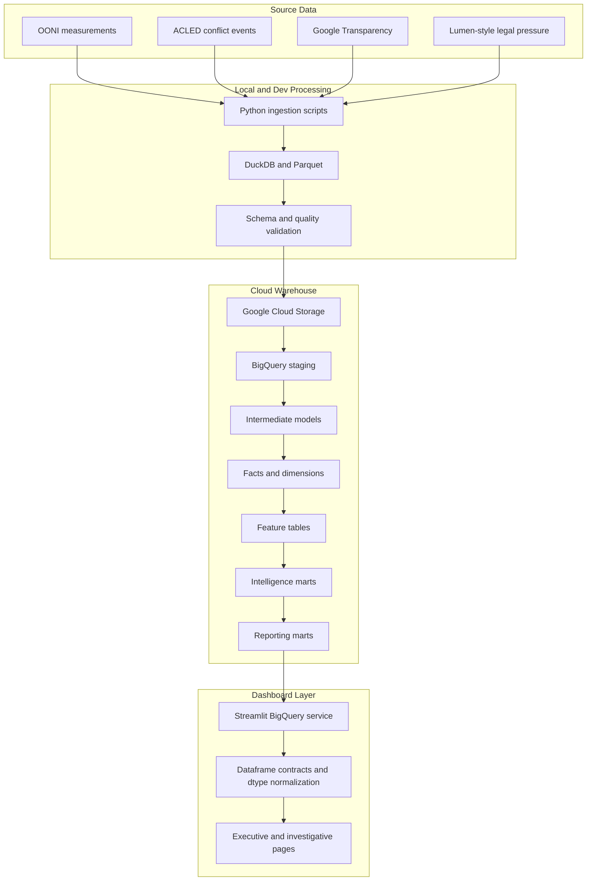

# Kenya Civil Liberties and Censorship Observatory

> A Bruin, BigQuery, and Streamlit intelligence platform for modeling digital repression, censorship pressure, and civil-liberties stress in Kenya from June 2023 through June 2025.

[](https://www.python.org/)
[](https://getbruin.com/)
[](https://cloud.google.com/bigquery)
[](https://streamlit.io/)
[](https://www.terraform.io/)
[](https://duckdb.org/)
[](https://parquet.apache.org/)

## What This Project Does

This project builds a historical observability platform for understanding how political pressure, legal pressure, platform takedowns, and network interference move together during high-pressure civil-liberties periods in Kenya.

It combines:

- OONI network interference measurements
- ACLED political conflict and protest pressure
- Google Transparency removal request indicators
- Lumen-style takedown and legal pressure data
- Bruin-orchestrated BigQuery marts
- Statistical anomaly and correlation models
- Streamlit intelligence dashboards

The system is not real-time surveillance. It is historical intelligence modeling for June 2023 through June 2025.

Core questions:

- Did protocol-level network interference rise during political stress windows?
- Which protocols showed abnormal behavior?
- Which ASNs concentrated the strongest censorship signals?
- Did pressure indicators align around the Finance Bill 2024 period?
- Which conclusions are statistically weak because of sparse data, low confidence, or zero variance?

## Why This Matters

Digital repression rarely appears as one clean signal. It can involve network instability, DNS anomalies, HTTP/TCP/TLS interference, platform policy actions, legal requests, protest pressure, and missing measurements.

This repository treats censorship analysis as a data engineering and statistical intelligence problem. Instead of relying on a single indicator, it fuses multiple pressure sources and applies explicit guardrails before surfacing a finding.

The result is a portfolio-grade civil-liberties observability system for:

- digital-rights researchers
- investigative journalists
- civil-society analysts
- policy teams
- analytics engineers
- data platform reviewers

---

## Dashboard Showcase

### National Stress Observatory


Country-level digital suppression pressure across Kenya (June 2023 – June 2025)

---

### Protocol Regime Monitor


Protocol-level censorship regime classification across Kenya (June 2023 – June 2025)

---

### Protocol Stress Intelligence Observatory


Tracks protocol-level anomaly pressure, escalation behavior, and statistical confidence across Kenya’s censorship surface.

---

### Protocol ↔ Repression Correlation Engine


Measures statistically validated alignment between protocol-level (dns this instance) anomaly escalation and national repression pressure.

---

### ASN Behavioral Intelligence


Behavioral observability profiles across Kenyan networks.

---

### Finance Bill 2024 Incident Report


Observed protocol behavior suggests structured suppression dynamics rather than isolated service instability.

---

### Suppression Event Explorer


Investigates synchronized censorship escalation windows across Kenya's protocol surface. Any date between scope

---

### Methodology & Statistical Guardrails


Explains how every signal is validated before entering intelligence outputs.text

---

## Quickstart

The setup path is intentionally early because the app depends on BigQuery credentials, Bruin connections, and a stable Python geospatial stack.

### 1. Clone

```bash
git clone https://github.com/Sanjomwa/Civil-Liberties-and-Censorship-Analysis-with-Bruin.git
cd Civil-Liberties-and-Censorship-Analysis-with-Bruin
```

### 2. Create a Python Environment

Using standard `venv`:

```bash
python -m venv .venv
source .venv/bin/activate
python -m pip install --upgrade pip setuptools wheel
python -m pip install --no-cache-dir -r streamlit/requirements.txt
```

Using `uv`:

```bash
uv venv
source .venv/bin/activate
uv pip install -r streamlit/requirements.txt
```

On Windows PowerShell:

```powershell
python -m venv .venv
.\.venv\Scripts\Activate.ps1
python -m pip install --upgrade pip setuptools wheel
python -m pip install --no-cache-dir -r streamlit\requirements.txt
```

### 3. Dependency Note: NumPy and Shapely

The Streamlit app imports BigQuery, which may import optional geospatial packages such as `geopandas` and `shapely`. To avoid NumPy ABI crashes, the dashboard requirements intentionally pin:

```text
numpy>=1.26.4,<2.0
shapely==2.0.3
geopandas==0.14.3
```

If you see an error like `A module that was compiled using NumPy 1.x cannot be run in NumPy 2.x`, rebuild the virtual environment and reinstall from `streamlit/requirements.txt`.

### 4. Environment Variables

The current implementation is configured around the original Kenya pilot project. Replace these values for your own deployment.

```bash
export GOOGLE_CLOUD_PROJECT="encoded-joy-485413-k5"
export GCP_PROJECT_ID="encoded-joy-485413-k5"
export GCS_BUCKET="civil-liberties-data"
export TARGET_ENV="staging"
export BRUIN_ENV="dev"
export COUNTRY="Kenya"
export ISO2="KE"
export DEFAULT_START="2023-06-01"
export DEFAULT_END="2025-06-30"
```

PowerShell:

```powershell
$env:GOOGLE_CLOUD_PROJECT = "encoded-joy-485413-k5"
$env:GCP_PROJECT_ID = "encoded-joy-485413-k5"
$env:GCS_BUCKET = "civil-liberties-data"
$env:TARGET_ENV = "staging"
$env:BRUIN_ENV = "dev"
$env:COUNTRY = "Kenya"
$env:ISO2 = "KE"
$env:DEFAULT_START = "2023-06-01"
$env:DEFAULT_END = "2025-06-30"
```

The Streamlit config also supports a `.env` file and Bruin config values when present.

### 5. Authenticate BigQuery

For local development:

```bash
gcloud auth application-default login
gcloud config set project encoded-joy-485413-k5
```

For service-account based execution:

```bash
export GOOGLE_APPLICATION_CREDENTIALS="/path/to/service-account.json"
gcloud auth activate-service-account --key-file "$GOOGLE_APPLICATION_CREDENTIALS"
gcloud config set project encoded-joy-485413-k5
```

### 6. Install Bruin

```bash
curl -LsSf https://getbruin.com/install/cli | sh
bruin --version
```

The Bruin pipeline expects these connection names:

- `bigquery-default`
- `duckdb-parquet`

### 7. Prepare Source Data

The project expects local source files before full pipeline execution.

Minimum source expectations:

- OONI JSONL gzip files normalized into `ooni_measurements.parquet`
- ACLED aggregated Kenya/Africa CSV export
- Google Transparency CSV exports
- Lumen-style Parquet data, generated or replaced with approved real exports

See [Data Sources and Acquisition Notes](README.md#data-sources-and-acquisition-notes) for details.

### 8. Run Bruin

From the repository root:

```bash
cd Bruin
bruin run pipeline.yml
```

Example targeted runs:

```bash
bruin run assets/features/protocol_daily_signals.sql
bruin run assets/intelligence/protocol_relationships.sql
bruin run assets/reporting/protocol_repression_correlation_mart.sql
```

### 9. Launch Streamlit

From the repository root:

```bash
cd streamlit
python -m streamlit run app.py
```

Open:

```text
http://localhost:8501
```

### 10. Codespaces Clean Reinstall

If Codespaces has stale dependencies:

```bash
cd /workspaces/Civil-Liberties-and-Censorship-Analysis-with-Bruin
deactivate 2>/dev/null || true
rm -rf .venv
python -m venv .venv
source .venv/bin/activate
python -m pip install --upgrade pip setuptools wheel
python -m pip install --no-cache-dir -r streamlit/requirements.txt

python - <<'PY'
import numpy, shapely, geopandas
from google.cloud import bigquery
print("numpy", numpy.__version__)
print("shapely", shapely.__version__)
print("geopandas", geopandas.__version__)
print("bigquery import ok")
PY

cd streamlit
python -m streamlit run app.py
```

Expected NumPy version:

```text
1.26.x
```

---

## Architecture Overview



Design principles:

- Keep raw ingestion auditable and re-runnable.
- Separate staging, feature engineering, intelligence inference, and reporting.
- Use statistical guardrails before making claims from noisy data.
- Preserve dashboard trust metadata such as mart versions and snapshot timestamps.
- Normalize BigQuery date and timestamp dtypes before dashboard validation.
- Treat pressure modeling as historical analysis, not real-time detection.

## Repository Structure

```text
.
|-- Bruin/
|   |-- pipeline.yml
|   |-- requirements.txt
|   `-- assets/
|       |-- ingest/          # Raw source ingestion assets
|       |-- load/            # GCS and BigQuery external table loaders
|       |-- staging/         # Source normalization models
|       |-- intermediate/    # Cross-source preparation models
|       |-- marts/
|       |   |-- dims/        # Conformed dimensions
|       |   `-- facts/       # Analytics-ready fact tables
|       |-- features/        # Model-ready protocol features
|       |-- intelligence/    # Regime and relationship inference
|       `-- reporting/       # Dashboard-facing marts
|-- .env.example             # Portable environment variable template
|-- .github/
|   `-- workflows/
|       |-- lint.yml         # CI lint scaffolding
|       `-- tests.yml        # CI test scaffolding
|-- docs/
|   |-- analysts-questions-playbook.md
|   |-- civil-liberties-reporting-playbook-Kenya.md
|   |-- data-modelling.md
|   |-- data_sources.md
|   |-- erd-lineage.md
|   `-- project_difficulties.md
|-- infra/
|   |-- main.tf
|   |-- provider.tf
|   |-- variables.tf
|   |-- setup-gcp.sh
|   |-- verify-gcp.sh
|   `-- modules/
|       |-- bigquery/
|       |-- gcs/
|       `-- iam/
|-- scripts/
|   |-- download_ooni.ps1
|   |-- local_ingest_ooni.py
|   `-- lumen_parquet.py
|-- streamlit/
|   |-- app.py
|   |-- requirements.txt
|   |-- pages/
|   |   `-- 3_Protocol__Stress_Intelligence_Observatory.py
|   |-- services/
|   |   |-- bq.py
|   |   `-- marts.py
|   |-- core/
|   |   |-- config.py
|   |   |-- constants.py
|   |   `-- contracts.py
|   |-- components/
|   |   |-- charts.py
|   |   |-- status.py
|   |   |-- tables.py
|   |   `-- trust.py
|   `-- assets/
|       |-- annotations/
|       `-- methodology/
|           `-- thresholds.yml
|-- tests/
|   `-- test_contracts.py    # Automated dashboard contract tests
|-- pyproject.toml
|-- uv.lock
`-- README.md
```

## Current Hardening Status

The latest project pass adds a stronger production-readiness foundation around configuration, contracts, CI, and dashboard stability.

| Upgrade                            | Status  | Where it appears                                                                                                                                |
| ---------------------------------- | ------- | ----------------------------------------------------------------------------------------------------------------------------------------------- |
| Config abstraction                 | Present | `streamlit/core/config.py`, `.env.example`, environment-driven project/country/date settings                                                    |
| Environment portability foundation | Present | `.env.example`, `TARGET_ENV`, `BRUIN_ENV`, `GOOGLE_CLOUD_PROJECT`, dataset config defaults                                                      |
| Dashboard schema contracts         | Present | `streamlit/core/contracts.py`, `streamlit/services/marts.py`                                                                                    |
| Automated validation tests         | Present | `tests/test_contracts.py`, Bruin validation assets                                                                                              |
| CI scaffolding                     | Present | `.github/workflows/lint.yml`, `.github/workflows/tests.yml`                                                                                     |
| Safer mart fetch enforcement       | Present | `streamlit/services/bq.py`, `streamlit/services/marts.py`, required-column and dtype validation                                                 |
| Cleaner service boundaries         | Present | `streamlit/services/bq.py` for BigQuery execution, `streamlit/services/marts.py` for mart queries, `streamlit/core/contracts.py` for validation |
| Reduced dashboard breakage risk    | Present | BigQuery dtype normalization, relaxed sparse-window null handling, resilient Protocol Stress page                                               |
| Better deployment portability      | Present | environment variables, `.env.example`, dependency pins, Codespaces reinstall path, Terraform modules                                            |

This does not mean the system is finished as a production SaaS. It means the project now has the scaffolding expected of a serious analytics engineering system: configurable runtime settings, contract-aware dashboard access, test entry points, CI entry points, and safer app-layer handling of real BigQuery behavior.

## Streamlit App Hardening

The dashboard has been hardened around the real BigQuery and Streamlit runtime behavior.

Current Streamlit stability improvements:

- `streamlit/requirements.txt` pins NumPy below 2 to avoid Shapely/GeoPandas ABI crashes.
- `python-dotenv` is included because `streamlit/core/config.py` loads `.env` values.
- `streamlit/services/bq.py` normalizes BigQuery `DATE` and timestamp fields after query execution.
- `streamlit/core/contracts.py` coerces expected dataframe dtypes before validation.
- `streamlit/services/marts.py` relaxes non-null contracts for statistically guarded fields.
- ASN values are treated as strings because the feature layer can include non-numeric values such as `unknown`.
- Page 3, the Protocol Stress Intelligence Observatory, now falls back to `anomaly_score` when `protocol_stress_score` is missing.
- `width="stretch"` is used in new components/pages instead of deprecated `use_container_width=True`.

These changes preserve contract validation while avoiding false empty-dashboard states.

## Data Sources and Acquisition Notes

| Source              | Role                                                            | Acquisition                                                                                                        | Notes                                                                       |
| ------------------- | --------------------------------------------------------------- | ------------------------------------------------------------------------------------------------------------------ | --------------------------------------------------------------------------- |
| OONI                | Network interference and protocol-level censorship measurements | Public OONI S3 data downloaded with `scripts/download_ooni.ps1` and normalized with `scripts/local_ingest_ooni.py` | Highest-volume source. Requires disk space and resumable processing.        |
| ACLED               | Protest, conflict, and political pressure context               | Manual export from ACLED export tools or API after account/API approval                                            | Most tedious source. The raw asset expects an aggregated CSV export.        |
| Google Transparency | Government/platform removal pressure                            | CSV export from Google Transparency Report                                                                         | Used as legal and platform pressure input after staging normalization.      |
| Lumen-style data    | Takedown/legal request pressure                                 | Generated Parquet fallback or approved Lumen export                                                                | Generated data keeps the pipeline runnable when real Lumen access is gated. |

### OONI

The downloader syncs Kenya measurements from OONI public S3 paths for selected tests:

- `web_connectivity`
- `whatsapp`
- `telegram`
- `facebook_messenger`
- `signal`
- `tor`
- `psiphon`
- `dnscheck`

Example normalization:

```bash
python scripts/local_ingest_ooni.py \
  --root "C:/ooni-kenya-censorship" \
  --out-file "C:/ooni-kenya-censorship/processed/ooni_measurements.parquet" \
  --start-date "2023-06-01" \
  --end-date "2025-06-30" \
  --probe-cc "KE" \
  --clean
```

### ACLED

ACLED requires special attention:

- You need an ACLED account and approved access.
- Exports may require manual filtering and date selection.
- The current raw asset expects an aggregated CSV similar to `Africa_aggregated_data_up_to_week_of-2026-03-14.csv`.
- The pipeline normalizes columns such as `WEEK`, `COUNTRY`, `EVENT_TYPE`, `EVENTS`, `FATALITIES`, and centroid coordinates.

For reproducibility, document the exact ACLED export filters used for any run.

### Google Transparency

The raw asset expects a CSV with fields such as:

- `time_period`
- `country`
- `cldr_territory`
- `requestor`
- `product`
- `reason`
- `number_of_requests`
- `items_requested_removal`
- `items_removed_legal`
- `items_removed_policy`

### Lumen

Direct Lumen data access can be gated. This repository uses generated Lumen-style data so the legal-pressure branch remains testable and the pipeline stays runnable.

When approved real exports are available, replace the generated Parquet with schema-compatible Lumen data.

## Data Model Design

The model separates source ingestion, feature generation, intelligence inference, and presentation.

| Layer        | Purpose                                            | Examples                                                                                      |
| ------------ | -------------------------------------------------- | --------------------------------------------------------------------------------------------- |
| Raw / ingest | Preserve source shape and land reprocessable files | OONI raw measurements, ACLED aggregated events, Google requests                               |
| Staging      | Normalize source fields and data types             | `stg.ooni`, `stg.acled_conflict_events`, `stg.google_transparency_requests`                   |
| Intermediate | Prepare cross-source pressure signals              | OONI observations, Google periodization, Lumen daily pressure                                 |
| Facts        | Analytics-ready event and daily pressure tables    | `fact_country_pressure_daily`, `fact_ooni_censorship_signals`, `fact_takedown_pressure_daily` |
| Dimensions   | Reference and descriptive context                  | `dim_dates`, `dim_asn`, `dim_country`, `dim_platforms`, `dim_reasons`                         |
| Features     | Model-ready statistical features                   | `features.protocol_daily_signals`                                                             |
| Intelligence | Inference over regimes and relationships           | `intelligence.protocol_signal_regimes`, `intelligence.protocol_relationships`                 |
| Reporting    | Streamlit-facing marts                             | `mart_political_stress_windows`, `protocol_repression_correlation_mart`                       |

Important reporting marts:

- `reporting.mart_political_stress_windows`
- `reporting.mart_protocol_interference_trends`
- `reporting.protocol_repression_correlation_mart`
- `reporting.asn_behavior_profile_mart`

## Statistical Methodology

### Rolling Baselines

Protocol and pressure signals are compared against rolling historical windows, usually 30-day or 90-day baselines. This detects abnormal movement relative to recent local behavior.

### Anomaly Scoring

Protocol anomaly scores measure deviations from expected signal behavior. Where variance exists, z-score style normalization is used.

### Sparse-Window Suppression

The system flags low-sample days, sparse baselines, and insufficient relationship windows. Dashboard contracts no longer reject these windows simply because guarded statistical fields are null.

### Confidence Weighting

Higher-confidence censorship observations contribute more strongly than ambiguous measurements.

### Variance Guardrails

Correlation and anomaly calculations are suppressed when one side of the window has no variance. This prevents false relationship claims.

### Protocol Intelligence Inference

The intelligence layer evaluates DNS, HTTP, TCP, and TLS behavior. It identifies elevated regimes, lag relationships, coupled protocol escalation, isolated protocol escalation, and confidence levels.

### Pressure Correlation Modeling

The correlation mart aligns protocol anomaly behavior with national pressure scores. It computes:

- rolling pressure correlation
- synchronized stress
- stress divergence
- correlation state
- alignment state
- divergence state

Interpretation categories include:

- `SYNCHRONIZED_ESCALATION`
- `INVERSE_MOVEMENT`
- `PROTOCOL_DIVERGENCE`
- `PRESSURE_ONLY`
- `NO_CLEAR_ALIGNMENT`

These are analytical signals, not proof of causality.

## Dashboard Page Walkthroughs

### 1. National Stress Observatory

Country-level pressure trends, suppression-window probability, baseline divergence, elevated protocol count, and quality context.

### 2. Protocol Regime Monitor

Protocol state monitoring across DNS, HTTP, TCP, and TLS. Tracks anomaly state, confidence level, severe observation share, elevated observation share, and insufficient observation share.

### 3. Protocol Stress Intelligence Observatory

Protocol-centric stress view. The page is resilient to mart versions where `protocol_stress_score` is missing or null by falling back to `anomaly_score` and displaying `N/A` for unavailable metrics.

### 4. Protocol-Repression Correlation Engine

Measures rolling alignment between protocol anomalies and national pressure. This is the main statistical relationship page.

### 5. ASN Behavioral Intelligence

Ranks networks by behavioral priority, weighted blocking, dominant protocol, evidence maturity, reliability, and coupled escalation activity.

### 6. Finance Bill 2024 Incident Report

Focuses on the June and July 2024 political window and reconstructs protocol, pressure, and ASN behavior around the Finance Bill crisis period.

### 7. Suppression Event Explorer

Exploratory view across suppression states, correlation states, divergence states, pressure levels, and protocol-specific stress signals.

### 8. Methodology and Statistical Guardrails

Documents assumptions, thresholds, confidence logic, limitations, and responsible interpretation constraints.

## Validation and Contracts

The repository includes Bruin checks, Python validation assets, and Streamlit dataframe contracts.

Bruin validation assets:

- `features.validate_protocol_daily_signals`
- `intelligence.validate_ooni_intelligence_contracts`

Streamlit contract layer:

- validates required columns
- coerces date and timestamp fields
- coerces numeric display fields
- supports string ASNs
- returns empty dataframes only for true contract failures
- avoids treating valid sparse/guarded statistical nulls as fatal

Current validation checks include:

- required columns
- unique feature or relationship identifiers
- valid dates and protocols
- signal rates and quality scores within expected bounds
- low-sample counts
- sparse windows
- zero-variance windows

Next contract upgrades:

- pytest-based mart contract tests
- Streamlit query schema snapshots
- freshness and row-count expectations
- CI failure on dashboard-facing schema drift
- source-specific quality thresholds

## Infrastructure and Deployment

Terraform under `infra/` provisions:

- Google Cloud Storage bucket
- BigQuery staging and production datasets
- IAM bindings

The infrastructure is useful for a reproducible project deployment, but it should be hardened before production use.

Recommended hardening:

- Move project IDs, bucket names, dataset IDs, and admin emails out of committed defaults.
- Use Secret Manager for dashboard and service-account credentials.
- Replace broad editor permissions with least-privilege IAM.
- Add Terraform remote state.
- Add CI gates for `terraform fmt`, `terraform validate`, SQL linting, and Python tests.
- Deploy Streamlit behind Cloud Run plus an authentication layer.

## Roadmap

Highest ROI next builds:

- Move project IDs, datasets, countries, date windows, thresholds, and weights into config.
- Add complete pytest mart contracts.
- Add multi-country support.
- Add evidence traceability from dashboard scores back to source rows.
- Add executive PDF exports for incident reports.
- Add Cloud Run deployment hardening.
- Add an API layer over reporting marts.
- Add analyst investigation workflows for event drilldown.
- Add an LLM analyst copilot grounded in evidence traces.
- Add cost controls, partitioning, clustering, and dashboard summary marts.

## Lessons Learned

- Setup instructions should be early and operational.
- ACLED acquisition friction should be documented honestly.
- Generated or substitute datasets must be clearly labeled.
- Statistical guardrails are core methodology, not decoration.
- BigQuery/Pandas dtype behavior matters in production dashboards.
- Dashboard contracts should protect users from schema drift without hiding valid sparse data.
- A polished intelligence UI is strongest when every visual can be traced back to a governed mart.

## Responsible Use

This system is observational and historical. It does not identify individuals, track users, exploit networks, or provide real-time operational surveillance.

Outputs should be interpreted as evidence-weighted indicators, not definitive proof of intent or causality. Civil-liberties analysis requires context, source awareness, and careful communication.

## Contact and Attribution

Project owner: Samwel Njogu  
X: [@sam_njogu9](https://x.com/sam_njogu9)

Built as a Kenya-focused civil-liberties observability platform using Bruin, BigQuery, Streamlit, Terraform, Python, OONI, ACLED, Google Transparency, and Lumen-style legal pressure data.

## License

This project is licensed under the MIT License.
