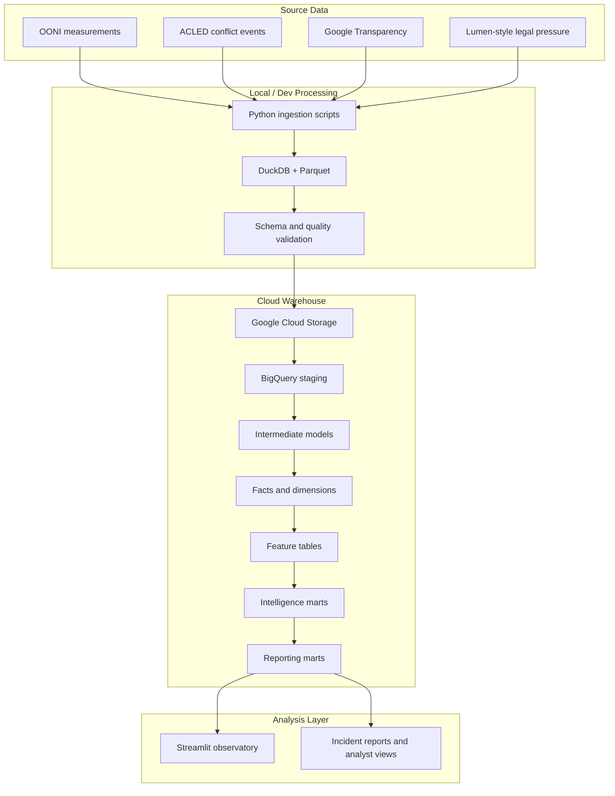

# Kenya Civil Liberties & Censorship Observatory

> A production-shaped Bruin + BigQuery + Streamlit intelligence system for analyzing digital repression, censorship pressure, and civil-liberties stress in Kenya from June 2023 through June 2025.

[](https://www.python.org/)
[](https://getbruin.com/)
[](https://cloud.google.com/bigquery)
[](https://streamlit.io/)
[](https://www.terraform.io/)
[](https://duckdb.org/)
[](https://parquet.apache.org/)

## What This Project Does

This repository models how political stress, legal pressure, platform takedowns, and network interference move together during high-pressure civil-liberties periods in Kenya.

It combines:

- OONI network interference measurements
- ACLED political conflict and protest pressure
- Google Transparency removal request indicators
- Lumen-style takedown/legal pressure data
- BigQuery feature, intelligence, and reporting marts
- Streamlit dashboards for executive and investigative analysis

The system is historical intelligence modeling, not real-time detection. It is designed to answer questions such as:

- Did protocol-level interference increase during political stress windows?
- Which network protocols showed abnormal behavior?
- Which ASNs concentrated the strongest censorship signals?
- Did pressure indicators align around the Finance Bill 2024 period?
- Where are signals statistically weak, sparse, or not interpretable?

## Why This Matters

Digital repression rarely appears as one clean event. It is usually a mixture of network instability, platform moderation, legal pressure, conflict context, and missing data.

This project treats censorship analysis as a data engineering and statistical observability problem. Instead of relying on a single indicator, it builds a multi-source pressure model with explicit guardrails for sparse data, unstable baselines, low confidence, and variance collapse.

The result is an auditable civil-liberties intelligence platform for researchers, journalists, civil-society analysts, policy teams, and analytics engineers studying how digital control mechanisms behave under political pressure.

## Dashboard Showcase

### National Stress Observatory


Country-level digital suppression pressure across Kenya (June 2023 – June 2025)

---

### Protocol Regime Monitor


Protocol-level censorship regime classification across Kenya (June 2023 – June 2025)

---

### Protocol Stress Intelligence Observatory


Tracks protocol-level anomaly pressure, escalation behavior, and statistical confidence across Kenya’s censorship surface.

---

### Protocol ↔ Repression Correlation Engine


Measures statistically validated alignment between protocol-level (dns this instance) anomaly escalation and national repression pressure.

---

### ASN Behavioral Intelligence


Behavioral observability profiles across Kenyan networks.

---

### Finance Bill 2024 Incident Report


Observed protocol behavior suggests structured suppression dynamics rather than isolated service instability.

---

### Suppression Event Explorer


Investigates synchronized censorship escalation windows across Kenya's protocol surface. Any date between scope

---

### Methodology & Statistical Guardrails


Explains how every signal is validated before entering intelligence outputs.text

---

## Quickstart

The fastest path is to clone the project, configure Python, authenticate to Google Cloud, install Bruin, prepare source data, run the Bruin pipeline, and launch Streamlit.

### 1. Clone

```bash
git clone https://github.com/Sanjomwa/Civil-Liberties-and-Censorship-Analysis-with-Bruin.git
cd Civil-Liberties-and-Censorship-Analysis-with-Bruin
```

### 2. Create a Python Environment

Using `uv`:

```bash
uv venv
source .venv/bin/activate
uv pip install -e ".[dev,test,streamlit]"
```

On Windows PowerShell:

```powershell
uv venv
.\.venv\Scripts\Activate.ps1
uv pip install -e ".[dev,test,streamlit]"
```

Using standard `venv`:

```bash
python -m venv .venv
source .venv/bin/activate
pip install -e ".[dev,test,streamlit]"
```

### 3. Set Environment Variables

The current implementation is configured around the original GCP project and Kenya analysis scope. For your own deployment, replace these values with your project, bucket, and dataset names.

```bash
export GOOGLE_CLOUD_PROJECT="encoded-joy-485413-k5"
export GCP_PROJECT_ID="encoded-joy-485413-k5"
export GCS_BUCKET="civil-liberties-data"
export TARGET_ENV="staging"
export BRUIN_ENV="dev"
```

PowerShell:

```powershell
$env:GOOGLE_CLOUD_PROJECT = "encoded-joy-485413-k5"
$env:GCP_PROJECT_ID = "encoded-joy-485413-k5"
$env:GCS_BUCKET = "civil-liberties-data"
$env:TARGET_ENV = "staging"
$env:BRUIN_ENV = "dev"
```

### 4. Authenticate BigQuery

For local development:

```bash
gcloud auth application-default login
gcloud config set project encoded-joy-485413-k5
```

For service-account based execution:

```bash
export GOOGLE_APPLICATION_CREDENTIALS="/path/to/service-account.json"
gcloud auth activate-service-account --key-file "$GOOGLE_APPLICATION_CREDENTIALS"
gcloud config set project encoded-joy-485413-k5
```

The Bruin pipeline expects these connection names from `Bruin/pipeline.yml`:

- `bigquery-default`
- `duckdb-parquet`

### 5. Install Bruin

Official Bruin CLI install:

```bash
curl -LsSf https://getbruin.com/install/cli | sh
bruin --version
```

If you use Windows and prefer PowerShell, install from the Bruin documentation or run the installer through a shell environment that supports `curl | sh`.

### 6. Prepare Data

This project expects local raw files before cloud publishing and BigQuery modeling. See [Data Sources and Acquisition Notes](#data-sources-and-acquisition-notes) for details.

Minimum source expectations:

- OONI JSONL gzip files normalized into `ooni_measurements.parquet`
- ACLED aggregated Kenya/Africa CSV export
- Google Transparency CSV exports
- Lumen-style Parquet data, generated or replaced with approved real exports

### 7. Run the Pipeline

From the repository root:

```bash
cd Bruin
bruin run pipeline.yml
```

Run a specific asset during development:

```bash
bruin run assets/features/protocol_daily_signals.sql
bruin run assets/intelligence/protocol_relationships.sql
bruin run assets/reporting/protocol_repression_correlation_mart.sql
```

### 8. Launch the Dashboard

```bash
cd ../streamlit
streamlit run app.py
```

Open the local Streamlit URL printed in the terminal, usually:

```text
http://localhost:8501
```

## Architecture Overview



Core design principles:

- Keep raw ingestion auditable and re-runnable.
- Separate staging, feature engineering, intelligence inference, and reporting.
- Use statistical guardrails before making claims from noisy data.
- Preserve dashboard trust metadata such as mart versions and snapshot timestamps.
- Treat pressure modeling as historical analysis, not real-time surveillance.

## Repository Structure

```text
.
├── Bruin/
│   ├── pipeline.yml
│   ├── requirements.txt
│   └── assets/
│       ├── ingest/          # Raw source ingestion assets
│       ├── load/            # GCS and BigQuery external table loaders
│       ├── staging/         # Source normalization models
│       ├── intermediate/    # Cross-source preparation models
│       ├── marts/
│       │   ├── dims/        # Conformed dimensions
│       │   └── facts/       # Analytics-ready fact tables
│       ├── features/        # Model-ready OONI protocol features
│       ├── intelligence/    # Protocol regime and relationship inference
│       └── reporting/       # Dashboard-facing marts
├── docs/
│   ├── analysts-questions-playbook.md
│   ├── civil-liberties-reporting-playbook-Kenya.md
│   ├── data-modelling.md
│   ├── data_sources.md
│   ├── erd-lineage.md
│   └── project_difficulties.md
├── infra/
│   ├── main.tf
│   ├── provider.tf
│   ├── variables.tf
│   ├── setup-gcp.sh
│   ├── verify-gcp.sh
│   └── modules/
│       ├── bigquery/
│       ├── gcs/
│       └── iam/
├── scripts/
│   ├── download_ooni.ps1
│   ├── local_ingest_ooni.py
│   └── lumen_parquet.py
├── streamlit/
│   ├── app.py
│   ├── pages/
│   ├── services/
│   ├── core/
│   ├── components/
│   └── requirements.txt
├── pyproject.toml
├── uv.lock
└── README.md
```

## Data Sources and Acquisition Notes

| Source              | Role                                                            | Acquisition                                                                                                         | Notes                                                                                                                     |
| ------------------- | --------------------------------------------------------------- | ------------------------------------------------------------------------------------------------------------------- | ------------------------------------------------------------------------------------------------------------------------- |
| OONI                | Network interference and protocol-level censorship measurements | Public OONI S3 data, downloaded with `scripts/download_ooni.ps1` and normalized with `scripts/local_ingest_ooni.py` | Highest-volume source. Requires substantial local disk and resumable processing.                                          |
| ACLED               | Protest, conflict, and political pressure context               | Manual export from ACLED export tools or API after account/API approval                                             | This is the most tedious source. The repository asset expects an aggregated CSV export, not an automatic public download. |
| Google Transparency | Government/platform removal pressure                            | CSV export from Google Transparency Report                                                                          | Used as legal/platform pressure input after staging normalization.                                                        |
| Lumen-style data    | Takedown/legal request pressure                                 | Generated Parquet fallback or approved Lumen export                                                                 | The project includes generated Lumen-style data to keep the pipeline reproducible when real Lumen access is unavailable.  |

### OONI

The PowerShell downloader syncs Kenya measurements from OONI public S3 paths for selected tests:

- `web_connectivity`
- `whatsapp`
- `telegram`
- `facebook_messenger`
- `signal`
- `tor`
- `psiphon`
- `dnscheck`

Example local normalization:

```bash
python scripts/local_ingest_ooni.py \
  --root "C:/ooni-kenya-censorship" \
  --out-file "C:/ooni-kenya-censorship/processed/ooni_measurements.parquet" \
  --start-date "2023-06-01" \
  --end-date "2025-06-30" \
  --probe-cc "KE" \
  --clean
```

### ACLED

ACLED access is intentionally called out because it is not frictionless:

- You need an ACLED account and approved access.
- Exports may require manual filtering and date selection.
- The current raw asset expects an aggregated CSV similar to `Africa_aggregated_data_up_to_week_of-2026-03-14.csv`.
- The pipeline then renames columns such as `WEEK`, `COUNTRY`, `EVENT_TYPE`, `EVENTS`, `FATALITIES`, and centroid coordinates into normalized fields.

For reproducible review, document the exact ACLED export parameters used with your local run.

### Google Transparency

The raw asset expects a CSV shaped around fields such as:

- `time_period`
- `country`
- `cldr_territory`
- `requestor`
- `product`
- `reason`
- `number_of_requests`
- `items_requested_removal`
- `items_removed_legal`
- `items_removed_policy`

### Lumen

Direct Lumen data access can be gated. This repository uses a generated Lumen-style dataset so the modeling layer remains runnable and the legal-pressure branch of the architecture stays visible.

When approved real exports are available, replace the generated Parquet with source-compatible Lumen data and preserve the expected schema.

## Data Model Design

The model is layered to keep source handling, feature engineering, intelligence inference, and dashboard presentation separate.

| Layer        | Purpose                                            | Examples                                                                                      |
| ------------ | -------------------------------------------------- | --------------------------------------------------------------------------------------------- |
| Raw / ingest | Preserve source shape and land reprocessable files | OONI raw measurements, ACLED aggregated events, Google requests                               |
| Staging      | Normalize source fields and data types             | `stg.ooni`, `stg.acled_conflict_events`, `stg.google_transparency_requests`                   |
| Intermediate | Prepare cross-source pressure signals              | OONI observations, Google periodization, Lumen daily pressure                                 |
| Facts        | Analytics-ready event and daily pressure tables    | `fact_country_pressure_daily`, `fact_ooni_censorship_signals`, `fact_takedown_pressure_daily` |
| Dimensions   | Reference and descriptive context                  | `dim_dates`, `dim_asn`, `dim_country`, `dim_platforms`, `dim_reasons`                         |
| Features     | Model-ready statistical features                   | `features.protocol_daily_signals`                                                             |
| Intelligence | Inference over regimes and relationships           | `intelligence.protocol_signal_regimes`, `intelligence.protocol_relationships`                 |
| Reporting    | Streamlit-facing marts                             | `mart_political_stress_windows`, `protocol_repression_correlation_mart`                       |

Key reporting marts:

- `reporting.mart_political_stress_windows`
- `reporting.mart_protocol_interference_trends`
- `reporting.protocol_repression_correlation_mart`
- `reporting.asn_behavior_profile_mart`

## Statistical Methodology

This project uses statistical guardrails to avoid over-reading noisy censorship data.

### Rolling Baselines

Protocol and pressure signals are compared against rolling historical windows, usually 30-day or 90-day baselines. This lets the system detect abnormal movement relative to recent local behavior instead of using a static global threshold.

### Anomaly Scoring

Protocol anomaly scores are derived from signal-rate deviations against rolling baselines. Where variance is available, z-score style normalization is used to identify unusually large deviations.

### Sparse-Window Suppression

Not every time window has enough observations to support inference. The feature and intelligence layers flag low-sample days, sparse baselines, and insufficient relationship windows. Downstream marts suppress or downgrade interpretation when the evidence base is too thin.

### Confidence Weighting

The system weights interference by confidence so that higher-quality censorship signals contribute more strongly than ambiguous or low-confidence observations.

### Variance Guardrails

Correlation and anomaly logic can break when one side of a window has no variation. The SQL models explicitly detect zero-variance windows and return null or guarded states instead of manufacturing a relationship.

### Protocol Intelligence Inference

The intelligence layer evaluates protocol behavior across DNS, HTTP, TCP, and TLS. It identifies elevated regimes, lag relationships, coupled protocol escalation, isolated protocol escalation, and confidence levels.

### Pressure Correlation Modeling

The correlation mart aligns protocol anomaly behavior with national pressure scores. It computes rolling correlations, synchronized stress, divergence states, and alignment categories such as:

- `SYNCHRONIZED_ESCALATION`
- `INVERSE_MOVEMENT`
- `PROTOCOL_DIVERGENCE`
- `PRESSURE_ONLY`
- `NO_CLEAR_ALIGNMENT`

These are analytical signals, not causal proof.

## Dashboard Page Walkthroughs

### 1. National Stress Observatory

Shows country-level pressure trends, suppression-window probability, baseline divergence, elevated protocol count, and data quality context.

### 2. Protocol Regime Monitor

Tracks DNS, HTTP, TCP, and TLS regime behavior over time. It highlights protocol stress, anomaly state, confidence level, and severe/elevated observation shares.

### 3. Protocol Stress Intelligence Observatory

Provides a protocol-centric intelligence surface for examining stress scores, confidence-weighted interference, trend states, and regime changes.

### 4. Protocol ↔ Repression Correlation Engine

Measures rolling alignment between protocol anomalies and national pressure. This is the main statistical relationship view for pressure-censorship synchronization.

### 5. ASN Behavioral Intelligence

Ranks networks by behavioral priority, weighted blocking, dominant protocol, evidence maturity, reliability, and coupled escalation activity.

### 6. Finance Bill 2024 Incident Report

Focuses on the June/July 2024 political window and reconstructs protocol, pressure, and ASN behavior around the Finance Bill crisis period.

### 7. Suppression Event Explorer

Supports exploratory investigation across suppression states, correlation states, divergence states, pressure levels, and protocol-specific stress signals.

### 8. Methodology & Statistical Guardrails

Explains the assumptions, thresholds, confidence logic, data limitations, and responsible interpretation constraints behind the observatory.

## Validation / Contracts

The repository includes both Bruin column checks and Python validation assets.

Examples:

- `features.validate_protocol_daily_signals`
- `intelligence.validate_ooni_intelligence_contracts`

Validation currently checks:

- Required columns
- Unique feature or relationship identifiers
- Null primary identifiers
- Valid date/country/protocol fields
- Signal rates and quality scores within expected bounds
- Sparse windows, zero-variance windows, and low-sample counts

Contract maturity roadmap:

- Add pytest-based mart contract tests.
- Snapshot every Streamlit query schema.
- Add freshness and row-count expectations.
- Fail CI when dashboard-facing marts drift.
- Add data quality thresholds by source and mart.

## Infrastructure + Deployment

Terraform under `infra/` provisions the cloud backbone:

- Google Cloud Storage bucket
- BigQuery staging and production datasets
- IAM bindings

The current Terraform setup is intentionally compact. It is useful for a reproducible portfolio deployment, but it should be hardened before production use.

Recommended production hardening:

- Move project IDs, bucket names, dataset IDs, and admin emails out of committed defaults.
- Use Secret Manager for dashboard and service-account credentials.
- Replace broad editor permissions with least-privilege IAM.
- Add Terraform remote state.
- Add CI gates for `terraform fmt`, `terraform validate`, SQL linting, and Python tests.
- Deploy Streamlit behind an authenticated service such as Cloud Run + Identity-Aware Proxy or an equivalent access layer.

## Roadmap

High-ROI next builds:

- Configuration abstraction for project IDs, datasets, country scope, dates, thresholds, and weights.
- Stronger mart contracts and CI validation.
- Multi-country support for comparative civil-liberties analysis.
- Evidence traceability from dashboard scores back to source rows and measurement IDs.
- Executive PDF exports for incident reports.
- Cloud deployment hardening for Streamlit, BigQuery, IAM, and secrets.
- API layer over reporting marts.
- Analyst investigation workflows for event drilldown.
- LLM analyst copilot grounded in reporting marts and evidence traces.
- Cost controls, partitioning, clustering, and dashboard summary marts.

## Responsible Use

This system is observational and historical. It does not identify individuals, track users, exploit networks, or provide real-time operational surveillance.

Outputs should be interpreted as evidence-weighted indicators, not definitive proof of government intent or causality. Civil-liberties analysis requires context, source awareness, and careful communication.

## Contact / Attribution

Project owner: Samwel Njogu  
X: [@sam_njogu9](https://x.com/sam_njogu9)

Built as a Kenya-focused civil-liberties observability platform using Bruin, BigQuery, Streamlit, Terraform, Python, OONI, ACLED, Google Transparency, and Lumen-style legal pressure data.

## License

This project is licensed under the MIT License.
