# CLIO — Civil Liberties Intelligence Observatory

> An active intelligence platform that fuses internet-censorship measurement (OONI), conflict and protest event data (ACLED), and platform/legal takedown-pressure signals (Google Transparency Report) into attributed, confidence-qualified findings about civil-liberties pressure. Kenya is the current pilot country — the methodology is built to generalize, not to stay Kenya-only.

[](https://www.python.org/)
[](https://getbruin.com/)
[](https://cloud.google.com/bigquery)
[](https://streamlit.io/)
[](https://www.terraform.io/)
[](https://duckdb.org/)
[](https://parquet.apache.org/)

## Scope

CLIO (Civil Liberties Intelligence Observatory) is Kenya-**piloted**, not Kenya-only. It combines network measurements, conflict indicators, legal-pressure signals, and platform transparency data into governed BigQuery marts and Streamlit intelligence views. Country, dataset, and date-range settings are pipeline configuration variables rather than hardcoded assumptions, so the same methodology is designed to extend to additional countries as they're onboarded.

Kenya's own data coverage is not a closed historical window, though it is honestly uneven across sources today: ACLED conflict-event history in the pipeline spans 1997 through 2026 and continues to extend as new weeks land, while the OONI/Google-Transparency-driven daily marts (the ones behind the composite pressure score) are currently bounded to a fixed June 2023 – June 2025 date-dimension window pending a data-spine widening — a real, disclosed limitation, not a claim that the project or its underlying measurement has stopped. This is an active, ongoing observatory, not a study that concluded in mid-2025. The project's flagship validated case study to date is the Finance Bill 2024 protests (see "Flagship Report" below), studied as one incident within that ongoing scope, not as its boundary.

The platform is designed to answer high-context analytical questions:

- Did network interference intensify during political stress windows?
- Which protocols showed abnormal censorship behavior?
- Which ASNs concentrated the strongest interference signals?
- Did pressure indicators align around the Finance Bill 2024 period?
- Which signals are statistically weak because of sparse data, low confidence, or zero variance?

The platform reconstructs civil-liberties pressure from historical and ongoing evidence; it does not perform live operational surveillance.

## Why This Matters

Digital repression is rarely observable through one clean dataset. It can appear as protocol anomalies, DNS or TCP failures, platform removals, legal pressure, protest dynamics, and inconsistent measurement coverage.

This project treats censorship analysis as an observability and inference problem. It fuses fragmented civil-liberties indicators into auditable statistical outputs, while preserving guardrails that prevent weak or sparse evidence from being overstated.

The result is a production-oriented reference architecture for civil-liberties observability, analytical inference, and governed public-interest intelligence reconstruction.

---

## Flagship Report: Finance Bill 2024

CLIO's first fully validated flagship deliverable reconstructs Kenya's June–July 2024 Finance Bill protests, connecting three independently sourced signals: ACLED's categorical regime classification (a MOBILISATION reading from the Bill's May 11, 2024 tabling, escalating to CRISIS the week Parliament was stormed), OONI network-measurement corroboration (a same-day spike in high-confidence DNS-blocking signals concentrated on Signal), and the platform's continuous composite pressure score. The report deliberately discloses, rather than smooths over, a real methodological disagreement between the categorical and continuous scoring approaches during the same window.

Every quantitative figure was independently re-verified against live BigQuery data. Lumen/legal-pressure data is deliberately excluded from the report, since it remains synthetic pending a real Lumen export — see "Data Licensing & Attribution" below. The full analysis is built as `streamlit/pages/7_Finance_Bill_2024_Incident_Report.py`; see "Live Dashboard" below for current access status.

---

## Dashboard Showcase

### National Stress Observatory


Executive view of national digital-pressure movement, baseline divergence, suppression-window probability, and evidence quality across the Kenya observation window.

---

### Protocol Regime Monitor


Protocol-level regime classification for DNS, HTTP, TCP, and TLS, showing when network behavior moves from normal range into elevated, severe, or insufficient-evidence states.

---

### Protocol Stress Intelligence Observatory


Comparative protocol-intelligence surface exposing anomaly escalation, confidence-weighted severity, and regime transition behavior across monitored transport layers.

---

### Protocol ↔ Repression Correlation Engine


Statistical alignment engine measuring whether protocol anomalies move with national repression-pressure indicators across rolling historical windows.

---

### ASN Behavioral Intelligence


Network-level intelligence view ranking ASNs by blocking intensity, behavioral priority, evidence maturity, dominant protocol, and reliability of observed interference.

---

### Finance Bill 2024 Incident Report


Focused reconstruction of the Finance Bill 2024 period, connecting protocol behavior, national pressure signals, and major-provider activity during a known political stress window.

---

### Suppression Event Explorer


Investigation surface for exploring synchronized censorship escalation windows, correlation states, divergence patterns, and protocol-specific pressure signals.

---

### Methodology & Statistical Guardrails


Methodology view documenting how sparse data, confidence weighting, variance checks, and rolling baselines constrain interpretation before signals enter intelligence outputs.

---

## Live Dashboard

Streamlit deployment:

https://civil-liberties-and-censorship-analysis-with-bruin-toafjdj5xoc.streamlit.app/

Key intelligence surfaces (9 pages):

- National Stress Observatory
- Protocol Regime Monitor
- Protocol Stress Intelligence
- Protocol Repression Correlation Engine
- ASN Behavioral Intelligence
- Suppression Event Explorer
- Finance Bill 2024 Incident Report
- Methodology & Statistical Guardrails
- Pressure Attribution

---

## How Bruin Is Used

- Python ingestion assets
- SQL transformation assets
- Asset dependency orchestration
- Feature and intelligence materialization
- Validation and quality checks
- Historical partition execution
- BigQuery-backed marts
- Streamlit-facing reporting assets

---

## Architecture Overview

```mermaid
flowchart LR
    Sources["OONI, ACLED, Google Transparency, Lumen-style data"]
    Ingest["Python ingestion and Parquet normalization"]
    Warehouse["BigQuery staging, facts, dimensions, features"]
    Intelligence["Protocol regimes, lag relationships, pressure correlation"]
    Reporting["Dashboard-facing reporting marts"]
    Contracts["Streamlit query services and dataframe contracts"]
    Dashboard["Streamlit intelligence observatory"]

    Sources --> Ingest
    Ingest --> Warehouse
    Warehouse --> Intelligence
    Intelligence --> Reporting
    Reporting --> Contracts
    Contracts --> Dashboard
```



Design principles:

- Preserve source data as re-runnable analytical inputs.
- Separate ingestion, staging, features, intelligence, and reporting.
- Apply statistical guardrails before surfacing intelligence claims.
- Preserve mart versioning and snapshot metadata in the dashboard.
- Normalize BigQuery date and timestamp types before dashboard validation.
- Treat the system as historical reconstruction, not live surveillance.

## Engineering Reliability Controls

| Control                              | Implementation                                                                                                                                                    |
| ------------------------------------ | ----------------------------------------------------------------------------------------------------------------------------------------------------------------- |
| Contract-enforced schema validation  | `streamlit/core/contracts.py` validates required columns, expected dtypes, and non-null fields for dashboard-facing marts.                                        |
| Environment portability              | `.env.example`, `streamlit/core/config.py`, `TARGET_ENV`, `BRUIN_ENV`, `GOOGLE_CLOUD_PROJECT`, country, date, and dataset settings support runtime configuration. |
| CI-backed verification               | `.github/workflows/lint.yml`, `.github/workflows/tests.yml`, and `tests/test_contracts.py` provide lint and contract-test entry points.                           |
| Query normalization                  | `streamlit/services/bq.py` normalizes BigQuery `DATE` and timestamp outputs before page rendering.                                                                |
| Sparse-window resilience             | Mart fetch contracts allow guarded statistical nulls where sparse history or zero variance makes inference unsafe.                                                |
| Dashboard contract safety            | `streamlit/services/marts.py` centralizes mart queries and validation before page code consumes results.                                                          |
| Service-layer separation of concerns | BigQuery execution, mart access, dataframe validation, reusable components, and page rendering are separated.                                                     |
| Deployment portability               | Dependency pins, `.env.example`, Terraform modules, and Codespaces reinstall commands reduce environment-specific breakage.                                       |

These controls are intended to keep the observatory stable across local development, Codespaces, and cloud-backed BigQuery execution.

## Repository Structure

Generated from the repository's tracked files (`git ls-files`), not the local working tree — some `docs/` subdirectories (internal planning and governance material) are deliberately excluded from the public repository via `.gitignore` and will not appear on a fresh clone.

```text
.
|-- Bruin/
|   |-- pipeline.yml
|   |-- requirements.txt
|   |-- config/
|   |   `-- observatory.yml
|   |-- scripts/
|   |   |-- country_literal_check/    # CI guard against hardcoded country literals
|   |   |-- historical_initializer/   # ACLED regime engine backfill driver
|   |   `-- staleness_check/          # Materialization-staleness CI guard
|   `-- assets/
|       |-- ingest/          # Raw source ingestion assets (OONI, ACLED, Google, Lumen)
|       |-- load/            # GCS and BigQuery external table loaders
|       |-- staging/         # Source normalization models
|       |-- intermediate/    # Cross-source preparation models
|       |-- marts/
|       |   |-- dims/        # Conformed dimensions
|       |   `-- facts/       # Analytics-ready fact tables
|       |-- features/        # Model-ready protocol and pressure features
|       |-- intelligence/    # Regime classification and relationship inference
|       `-- reporting/       # Dashboard-facing marts, incl. pressure-attribution
|-- .env.example             # Portable environment variable template
|-- .github/
|   `-- workflows/
|       |-- lint.yml                    # CI lint scaffolding
|       |-- tests.yml                   # CI test scaffolding
|       |-- gcp-auth.yml                # Workload Identity Federation auth check
|       |-- staleness-check.yml         # Materialization-staleness CI job
|       `-- country-literal-check.yml   # Hardcoded-country-literal CI guard
|-- docs/
|   |-- 02-architecture/     # ADRs, architecture assessment, decision log, TD inventory
|   |   `-- adr/             # Accepted architecture decision records
|   |-- 03-development/      # Coding standards, testing strategy, documentation standards
|   `-- (legacy flat docs)   # analysts-questions-playbook.md, data-modelling.md,
|                             # data_sources.md, erd-lineage.md, and others predating
|                             # the numbered docs/ restructure
|-- infra/
|   |-- main.tf
|   |-- provider.tf
|   |-- variables.tf
|   |-- setup-gcp.sh
|   |-- verify-gcp.sh
|   `-- modules/
|       |-- bigquery/
|       |-- gcs/
|       `-- iam/
|-- scripts/
|   |-- download_ooni.ps1
|   |-- local_ingest_ooni.py
|   `-- lumen_parquet.py
|-- streamlit/
|   |-- app.py
|   |-- requirements.txt
|   |-- pages/                # 9 pages: National Stress Observatory, Protocol Regime
|   |   |                     # Monitor, Protocol Stress Intelligence, Protocol
|   |   |                     # Repression Correlation, ASN Behavioral Intelligence,
|   |   |                     # Suppression Event Explorer, Finance Bill 2024 Incident
|   |   |                     # Report, Methodology & Statistical Guardrails, Pressure
|   |   |                     # Attribution
|   |-- services/
|   |   |-- bq.py
|   |   |-- marts.py
|   |   `-- freshness.py
|   |-- core/
|   |   |-- config.py
|   |   |-- constants.py
|   |   |-- contracts.py
|   |   |-- filters.py
|   |   |-- layout.py
|   |   |-- state.py
|   |   `-- theme.py
|   |-- components/
|   |   |-- charts.py
|   |   |-- kpis.py
|   |   |-- status.py
|   |   |-- tables.py
|   |   `-- trust.py          # ACLED/OONI attribution footer
|   `-- assets/
|       |-- annotations/
|       `-- methodology/
|           `-- thresholds.yml
|-- tests/
|   |-- fixtures/
|   |   `-- acled_regimes_golden/            # Golden-file fixtures for regime classification
|   |-- test_contracts.py                    # Dashboard contract validation tests
|   |-- test_acled_pressure_regimes_golden.py
|   `-- test_ooni_dns_bogon_classification.py
|-- pyproject.toml
|-- uv.lock
`-- README.md
```

---

## Quickstart

### 1. Clone

```bash
git clone https://github.com/Sanjomwa/Civil-Liberties-Intelligence-Observatory.git
cd Civil-Liberties-Intelligence-Observatory
```

### 2. Create a Python Environment

Using standard `venv`:

```bash
python -m venv .venv
source .venv/bin/activate
python -m pip install --upgrade pip setuptools wheel
python -m pip install --no-cache-dir -r streamlit/requirements.txt
```

Using `uv`:

```bash
uv venv
source .venv/bin/activate
uv pip install -r streamlit/requirements.txt
```

On Windows PowerShell:

```powershell
python -m venv .venv
.\.venv\Scripts\Activate.ps1
python -m pip install --upgrade pip setuptools wheel
python -m pip install --no-cache-dir -r streamlit\requirements.txt
```

### 3. Dependency Compatibility

The dashboard requirements pin the geospatial stack to avoid NumPy ABI conflicts during BigQuery imports:

```text
numpy>=1.26.4,<2.0
shapely==2.0.3
geopandas==0.14.3
```

If dependency state is stale, rebuild the virtual environment and reinstall from `streamlit/requirements.txt`.

### 4. Environment Variables

Replace these values for your own deployment.

```bash
export GOOGLE_CLOUD_PROJECT="encoded-joy-485413-k5"
export GCP_PROJECT_ID="encoded-joy-485413-k5"
export GCS_BUCKET="civil-liberties-data"
export TARGET_ENV="staging"
export BRUIN_ENV="dev"
export COUNTRY="Kenya"
export ISO2="KE"
export DEFAULT_START="2023-06-01"
export DEFAULT_END="2025-06-30"
```

PowerShell:

```powershell
$env:GOOGLE_CLOUD_PROJECT = "encoded-joy-485413-k5"
$env:GCP_PROJECT_ID = "encoded-joy-485413-k5"
$env:GCS_BUCKET = "civil-liberties-data"
$env:TARGET_ENV = "staging"
$env:BRUIN_ENV = "dev"
$env:COUNTRY = "Kenya"
$env:ISO2 = "KE"
$env:DEFAULT_START = "2023-06-01"
$env:DEFAULT_END = "2025-06-30"
```

The Streamlit configuration also supports `.env` values and Bruin configuration defaults.

### 5. Authenticate BigQuery

For local development:

```bash
gcloud auth application-default login
gcloud config set project encoded-joy-485413-k5
```

For service-account based execution:

```bash
export GOOGLE_APPLICATION_CREDENTIALS="/path/to/service-account.json"
gcloud auth activate-service-account --key-file "$GOOGLE_APPLICATION_CREDENTIALS"
gcloud config set project encoded-joy-485413-k5
```

### 6. Install Bruin

```bash
curl -LsSf https://getbruin.com/install/cli | sh
bruin --version
```

The Bruin pipeline expects these connection names:

- `bigquery-default`
- `duckdb-parquet`

### 7. Prepare Source Data

Minimum source expectations:

- OONI JSONL gzip files normalized into `ooni_measurements.parquet`
- ACLED aggregated Kenya/Africa CSV export
- Google Transparency CSV exports
- Lumen-style Parquet data, generated or replaced with approved real exports

See `/docs` for expanded data acquisition and modeling notes.

### 8. Run Bruin

From the repository root:

```bash
cd Bruin
bruin run pipeline.yml
```

Example targeted runs:

```bash
bruin run assets/features/protocol_daily_signals.sql
bruin run assets/intelligence/protocol_relationships.sql
bruin run assets/reporting/protocol_repression_correlation_mart.sql
```

### 9. Launch Streamlit

From the repository root:

```bash
cd streamlit
python -m streamlit run app.py
```

Open:

```text
http://localhost:8501
```

### 10. Codespaces Clean Reinstall

```bash
cd /workspaces/Civil-Liberties-and-Censorship-Analysis-with-Bruin
deactivate 2>/dev/null || true
rm -rf .venv
python -m venv .venv
source .venv/bin/activate
python -m pip install --upgrade pip setuptools wheel
python -m pip install --no-cache-dir -r streamlit/requirements.txt

python - <<'PY'
import numpy, shapely, geopandas
from google.cloud import bigquery
print("numpy", numpy.__version__)
print("shapely", shapely.__version__)
print("geopandas", geopandas.__version__)
print("bigquery import ok")
PY

cd streamlit
python -m streamlit run app.py
```

Expected NumPy version:

```text
1.26.x
```

---

## Data Model and Methodology

### Source Inputs

| Source              | Analytical role                                                 |
| ------------------- | --------------------------------------------------------------- |
| OONI                | Network interference and protocol-level censorship measurements |
| ACLED               | Protest, conflict, and political pressure context               |
| Google Transparency | Government and platform removal-pressure indicators             |
| Lumen-style data    | Takedown and legal-pressure signal branch — currently **synthetic**, not a real Lumen export; every dashboard page and mart that touches it discloses this via a visible `is_synthetic` flag |

ACLED ingestion depends on approved API or export access; reproducibility guidance is documented in `/docs`. See "Data Licensing & Attribution" below for each source's reuse terms.

### Modeling Layers

| Layer        | Purpose                                            | Examples                                                                                      |
| ------------ | -------------------------------------------------- | --------------------------------------------------------------------------------------------- |
| Raw / ingest | Preserve source shape and land reprocessable files | OONI raw measurements, ACLED aggregated events, Google requests                               |
| Staging      | Normalize source fields and data types             | `stg.ooni`, `stg.acled_conflict_events`, `stg.google_transparency_requests`                   |
| Intermediate | Prepare cross-source pressure signals              | OONI observations, Google periodization, Lumen daily pressure                                 |
| Facts        | Analytics-ready event and daily pressure tables    | `fact_country_pressure_daily`, `fact_ooni_censorship_signals`, `fact_takedown_pressure_daily` |
| Dimensions   | Reference and descriptive context                  | `dim_dates`, `dim_asn`, `dim_country`, `dim_platforms`, `dim_reasons`                         |
| Features     | Model-ready statistical features                   | `features.protocol_daily_signals`                                                             |
| Intelligence | Inference over regimes and relationships           | `intelligence.protocol_signal_regimes`, `intelligence.protocol_relationships`                 |
| Reporting    | Streamlit-facing marts                             | `mart_political_stress_windows`, `protocol_repression_correlation_mart`                       |

Key reporting marts:

- `reporting.mart_political_stress_windows`
- `reporting.mart_protocol_interference_trends`
- `reporting.protocol_repression_correlation_mart`
- `reporting.asn_behavior_profile_mart`
- `reporting.mart_pressure_attribution_daily` and its conflict-driver/platform-driver/OONI-daily counterparts — decompose the composite pressure score into named, sourced drivers (see the Pressure Attribution dashboard page)

### Statistical Methodology

The platform uses guarded statistical inference rather than raw-count interpretation.

Core methods:

- Rolling baselines compare current pressure against recent historical behavior.
- Anomaly scoring measures protocol deviation from expected signal patterns.
- Sparse-window suppression prevents weak evidence from producing strong claims.
- Confidence weighting gives stronger influence to higher-quality observations.
- Variance guardrails suppress correlation claims when statistical windows collapse.
- Protocol inference evaluates DNS, HTTP, TCP, and TLS regime behavior.
- Pressure correlation modeling aligns protocol anomalies with national pressure signals.

Correlation outputs include:

- `SYNCHRONIZED_ESCALATION`
- `INVERSE_MOVEMENT`
- `PROTOCOL_DIVERGENCE`
- `PRESSURE_ONLY`
- `NO_CLEAR_ALIGNMENT`

These states are analytical indicators, not causal findings.

## Validation and Contracts

The repository includes Bruin validation assets, Streamlit dataframe contracts, and pytest-based contract checks.

Bruin validation assets:

- `features.validate_protocol_daily_signals`
- `intelligence.validate_ooni_intelligence_contracts`

Streamlit contract layer:

- validates required mart columns
- coerces date and timestamp fields
- coerces numeric display fields
- supports string ASNs
- permits valid sparse-window nulls
- returns empty dataframes only for true contract failures

Automated test entry point:

```bash
pytest -q
```

Lint entry point:

```bash
ruff check .
```

## Infrastructure and Deployment

Terraform under `infra/` provisions the cloud backbone:

- Google Cloud Storage bucket
- BigQuery staging and production datasets
- IAM bindings

Deployment portability is supported through:

- environment variable configuration
- `.env.example`
- Terraform modules
- pinned dashboard dependencies
- CI lint and test workflows

Additional production controls may include: secret management, least-privilege IAM, remote Terraform state, authenticated dashboard hosting, and BigQuery cost controls.

## Roadmap

Near-term platform evolution:

- Multi-country expansion using configurable country, dataset, and date settings
- Deeper mart contract coverage across all dashboard-facing models
- Evidence lineage tracing from dashboard scores back to source records
- Deployment hardening for authenticated cloud hosting
- Reporting API layer over curated marts

## Responsible Use

This system is observational and historical. It does not identify individuals, track users, exploit networks, or provide real-time operational surveillance.

Outputs should be interpreted as evidence-weighted indicators, not definitive proof of intent or causality. Civil-liberties analysis requires context, source awareness, and careful communication.

## Data Licensing & Attribution

CLIO's evidence sources carry their own, separate licensing terms, re-verified directly from primary sources:

- **OONI** — CC BY-NC-SA 4.0 (Attribution-NonCommercial-ShareAlike).
- **ACLED** — a contractual, non-Creative-Commons license: free for non-commercial use with registration; commercial use requires a separate paid license from ACLED.
- **Google Transparency Report** — no source-specific reuse license could be located; status is undetermined, not assumed compliant.
- **Lumen Database** — the platform's current Lumen-derived figures are synthetic placeholders, not real Lumen data (see "Data Model and Methodology" above).

Because of the OONI and ACLED terms above, **CLIO's OONI- and ACLED-derived intelligence layer is treated as non-commercial and grant/public-interest-funded for the foreseeable term, not as a product for direct sale.** This project does not redistribute the underlying third-party datasets — only transforms them into attributed, confidence-qualified findings — but transformation does not, on its own, remove either source's NonCommercial restriction. The Finance Bill 2024 flagship report is released as free public-interest research, not a paid deliverable.

This posture governs CLIO's data and findings; it is separate from the MIT license on this repository's own code (see below).

## Attribution and License

Maintained by Samwel Njogu  
X: [@sam_njogu9](https://x.com/sam_njogu9)

Built as a civil-liberties observability platform — currently piloted in Kenya — using Bruin, BigQuery, Streamlit, Terraform, Python, OONI, ACLED, Google Transparency, and Lumen-style legal pressure data.

This repository's own code is licensed under the MIT License. Third-party data sources retain their own separate licensing terms — see "Data Licensing & Attribution" above.
