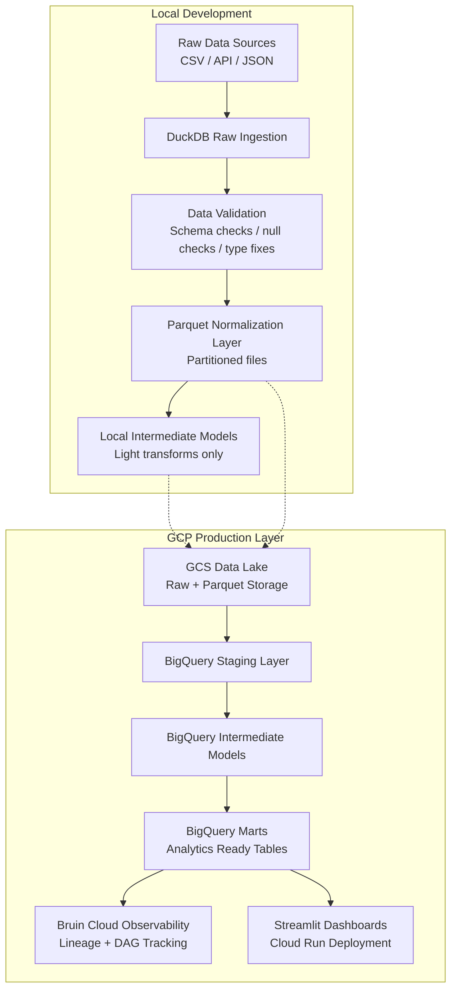
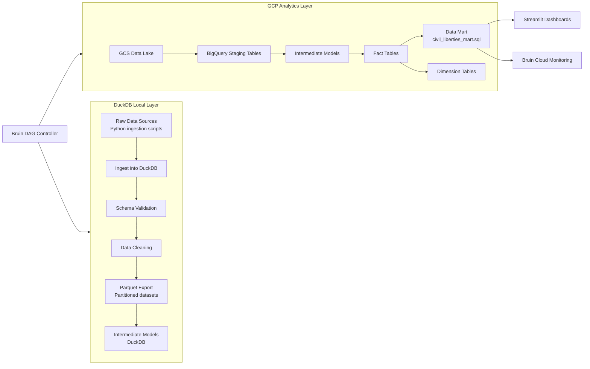
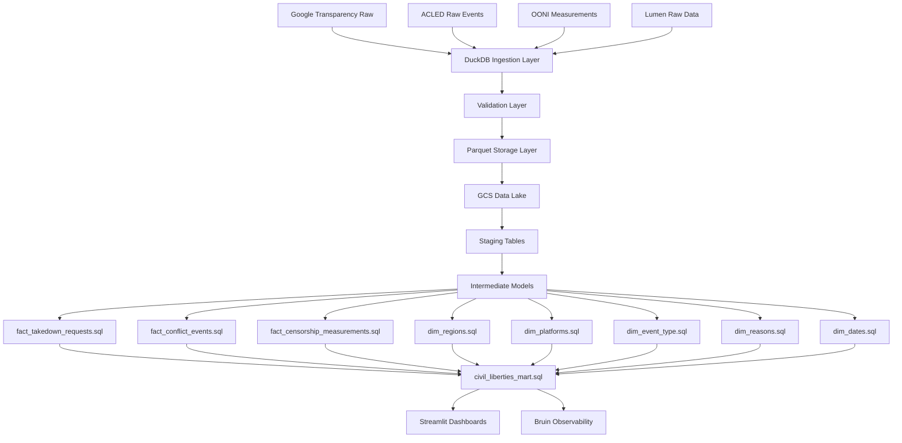

# Kenya Civil Liberties & Censorship Observatory
---

### Tracking Digital Repression & its Real-World Impact (June 2023 → June 2025)  
**🇰🇪**

**Powered by |** 
---


---

## Problem Statement

Governments are increasingly intervening in digital spaces through:

  - Content takedown requests
  - Platform-level restrictions
  - Network interference and blocking

While sometimes justified, these actions may intensify during political instability — raising concerns about civil liberties erosion in moments of crisis.

### Why Kenya?
**🇰🇪**

Kenya provides a high-signal environment where three forces intersect:

**📌 Political unrest**

Protests and conflict events (ACLED)

**📌 Digital censorship pressure**

Google / Lumen takedown requests

**📌 Network-level interference**

Blocking signals and access disruptions (OONI)

🔍 Core Insight Question
```
Do spikes in political conflict correspond to measurable increases in digital censorship and network interference in Kenya?
```

### 📊 What this system enables
  - Detect censorship spikes during unrest windows
  - Compare platform vs network-level suppression
  - Identify regional and temporal suppression patterns
  - Quantify a unified Civil Liberties Pressure Index
    
### 🧭 Outcome

A one-of-its-kind observatory that connects:

**street-level political instability → digital information control**

## Table of Contents

- [Why It Matters](#why-it-matters)
- [Audience](#audience)
- [Tech Stack](#tech-stack)
- [Architecture](#architecture)
- [Data Pipeline](#data-pipeline)
- [Data Model Overview](#data-model-overview)
- [ERD and Lineage](#erd-and-lineage)
- [Project Structure](#project-structure)
- [Datasets](#datasets)
- [Data Modelling](#data-modelling)
- [Setup Instructions](#setup-instructions)
- [Infrastructure](#infrastructure)
- [Dashboards](#dashboards)
- [Ethics and Responsible Use](#ethics-and-responsible-use)
- [License](#license)
- [Acknowledgements](#acknowledgements)
- [Contact](#contact)
---

## 🌍

## Why It Matters

- Rising global censorship trends
- Increasing digital authoritarianism
- Lack of transparent reproducible pipelines
- Need for auditable civil liberties monitoring systems

Kenya is used as a case study, but architecture is globally reusable

---

## 👥 
## Audience

- Researchers (digital rights)
- Journalists (investigations)
- Civil society (accountability)
- Data engineers (real-world pipelines)

---

## ⚙️ 
## Tech Stack 

| Layer                      | Tools                         | Role in System                                                               |
| -------------------------- | ----------------------------- | ---------------------------------------------------------------------------- |
| **Workflow Orchestration** | Bruin                         | DAG execution, asset dependency graph, scheduling, lineage tracking          |
| **Local Compute Engine**   | DuckDB                        | Fast analytical engine for raw ingestion, validation, parquet transformation |
| **Data Formats**           | Parquet                       | Columnar storage, partitioning, cloud transfer format                        |
| **Cloud Storage Layer**    | GCS (Google Cloud Storage)    | Raw + processed dataset lake                                                 |
| **Warehouse**              | BigQuery                      | Staging → intermediate → marts (analytics layer)                             |
| **Infrastructure as Code** | Terraform                     | GCP provisioning (IAM, GCS, BigQuery, Cloud Run)                             |
| **Dashboard Layer**        | Streamlit                     | Interactive analytics + storytelling layer                                   |
| **Deployment**             | Cloud Run                     | Containerized dashboard hosting                                              |
| **Dev Environment**        | VSCode + Codespaces + Bash    | Local execution, debugging, shell orchestration                              |
| **Data Processing**        | Python 3.12                   | Transformations, validation, orchestration glue                              |
| **Package Management**     | uv                            | Fast dependency resolution and reproducibility                               |
| **CI/CD**                  | GitHub Actions                | Testing, linting, infra deployment, app deployment                           |
| **Data Quality**           | SQL + Python validation rules | NOT NULL, uniqueness, schema enforcement                                     |
| **Version Control**        | Git + GitHub                  | Collaboration + reproducibility                                              |
| **Documentation**          | Markdown + Mermaid            | Architecture + lineage + ERD visualization                                   |


---

## 🏗️

##  Architecture
  DUCKDB does: 
    •	raw validation 
    •	parquet normalization 
    •	local transformation sandbox 
  GCP does: 
    •	staging 
    •	intermediate + marts 
    


---

## 🚧
## Data Pipeline (DAG)




Defined in:
```yaml
pipeline.yml
```
Schedule: @daily
Start date: 2023-06-01
Targets: DuckDB (dev), BigQuery (prod)

---

🧠 Data Model Overview
Layers
| Layer   | Purpose                  |
| ------- | ------------------------ |
| Raw     | Source ingestion         |
| Staging | Cleaning + normalization |
| Dims    | Reference tables         |
| Facts   | Event-level data         |
| Mart    | Unified analytics        |

---

## 📐
## ERD & Lineage

```mermaid
erDiagram
google_transparency_detailed ||--o{ stg_google_transparency_detailed : ""
google_transparency_requests ||--o{ stg_google_transparency_requests : ""
lumen_raw ||--o{ stg_lumen_requests : ""
ooni_raw ||--o{ stg_ooni : ""
raw_acled_aggregated ||--o{ stg_acled_conflict_events : ""

stg_google_transparency_detailed }o--|| dim_platforms : ""
stg_google_transparency_detailed }o--|| dim_reasons : ""
stg_google_transparency_detailed }o--|| dim_regions : ""
stg_google_transparency_detailed }o--|| dim_dates : ""

stg_google_transparency_requests }o--|| dim_platforms : ""
stg_google_transparency_requests }o--|| dim_reasons : ""
stg_google_transparency_requests }o--|| dim_regions : ""
stg_google_transparency_requests }o--|| dim_dates : ""

stg_lumen_requests }o--|| dim_reasons : ""
stg_lumen_requests }o--|| dim_regions : ""
stg_lumen_requests }o--|| dim_dates : ""

stg_ooni }o--|| dim_regions : ""
stg_ooni }o--|| dim_dates : ""
stg_ooni }o--|| dim_asn : ""
stg_ooni }o--|| dim_blocking_signals : ""
stg_ooni }o--|| dim_measurement_quality : ""

stg_acled_conflict_events }o--|| dim_regions : ""
stg_acled_conflict_events }o--|| dim_dates : ""
stg_acled_conflict_events }o--|| dim_event_type : ""

fact_takedown_requests }o--|| dim_platforms : ""
fact_takedown_requests }o--|| dim_reasons : ""
fact_takedown_requests }o--|| dim_regions : ""
fact_takedown_requests }o--|| dim_dates : ""

fact_conflict_events }o--|| dim_event_type : ""
fact_conflict_events }o--|| dim_regions : ""
fact_conflict_events }o--|| dim_dates : ""

fact_censorship_measurements }o--|| dim_asn : ""
fact_censorship_measurements }o--|| dim_blocking_signals : ""
fact_censorship_measurements }o--|| dim_measurement_quality : ""
fact_censorship_measurements }o--|| dim_regions : ""
fact_censorship_measurements }o--|| dim_dates : ""

fact_platform_blocking_summary }o--|| dim_platforms : ""
fact_platform_blocking_summary }o--|| dim_regions : ""
fact_platform_blocking_summary }o--|| dim_dates : ""

fact_cross_source_censorship_events }o--|| dim_regions : ""
fact_cross_source_censorship_events }o--|| dim_dates : ""
```


---

##📂

## Project Structure

This repository follows a **modern data engineering + analytics** layout optimized for:

- Bruin orchestration
- Terraform infrastructure
- Streamlit dashboards
- Clear documentation and separation of concerns

## 📁 Overall Directory Tree

```bash
.
├── .vscode/                          # VS Code workspace settings
├── Bruin/                            # Core data pipeline (orchestration)
│   └── assets/                       # All Bruin assets (raw, staging, int, marts, etc.)
├── docs/                             # Documentation & knowledge base
│   ├── data-modelling.md
│   ├── erd-lineage.md
│   └── analysts-questions-playbook.md
├── infra/                            # Infrastructure as Code (Terraform)
│   ├── modules/
│   │   ├── bigquery/                 # BigQuery resources
│   │   ├── gcs/                      # Google Cloud Storage buckets
│   │   └── iam/                      # IAM roles & service accounts
│   ├── main.tf
│   ├── provider.tf
│   ├── variables.tf
│   └── terraform.tfvars
├── streamlit/                        # Interactive dashboards & analytics UI
│   ├── pages/                        # Multi-page Streamlit app
│   ├── utils/                        # Helper functions & data loaders
│   ├── app.py                        # Main Streamlit application
│   └── requirements.txt
├── pipeline.yml                      # Bruin pipeline configuration
├── requirements.txt                  # Python dependencies (shared)
├── README.md                         # Project overview & getting started
└── LICENSE                           # License file
---
```

---

## 📌 

## Data Access
### Lumen Database Access
The Lumen Database aggregates takedown requests across multiple platforms. However, access requires approval and is not guaranteed for all researchers. Since direct access was not available during this project, we generated mock Lumen‑style data via a Python script to ensure pipeline completeness and reproducibility.

### Why Mock Data?
- Keeps the ERD and lineage tables intact (stg_lumen.sql, fact_lumen_platforms.sql).

- Ensures the pipeline runs end‑to‑end without missing assets.

- Dates and fields are aligned to the 2024–2026 timeframe for consistency with other datasets.

- Demonstrates reproducibility, even when real data is gated.

### How to Swap for Real Sources
- Replace mock_lumen_data.csv with actual Lumen exports once access is granted.

- Adjust ingestion assets (bruin/assets/ingest/lumen_raw.py) to point to the real CSV/API.

- Pipeline will run unchanged — staging, facts, marts and reporting are schema‑compatible.

### Optional Enrichment
If Lumen access remains unavailable, similar transparency datasets can be substituted although fragmented for the time period of the project scope:

- Meta Transparency Center (Facebook/Instagram government requests).

- X (Twitter) Transparency Archive (government takedown summaries).

- Google Transparency Report (already included).
  
---

## 📊
## Datasets

| Dataset | Source | Access Method | Coverage Focus | Key Fields |
| --- | --- | --- | --- | --- |
| Google Transparency Report | [Google Transparency](https://transparencyreport.google.com/government-removals/data) | CSV download (semi‑annual files) | Global, filter Kenya | request_id, date, requester, platform, motive, items_requested, action_taken |
| ACLED (Armed Conflict Location & Event Data) | [ACLED Export Tool](https://acleddata.com/data-export-tool/) (myACLED account required) | CSV export tool or API | Kenya events | event_id, event_date, county, event_type, actors, fatalities |
| Lumen Database (Takedown Requests) | [Lumen Database](https://lumendatabase.org) | CSV/JSON export, API | Global, filter Kenya | lumen_id, date, platform, request_type, requester, outcome |
| OONI (Open Observatory of Network Interference) | [OONI Data](https://ooni.org/data/) | API / CSV download | Kenya‑specific | test_id, date, platform, shutdown_type, measurement |
| WHO Infodemic Proxies *(Optional)* | WHO datasets / reports | Manual CSV / API | Kenya‑specific | misinfo_event_id, date, topic, severity |


| Dataset             | Purpose              |
| ------------------- | -------------------- |
| Google Transparency | Government takedowns |
| Lumen (mock)        | Legal requests       |
| OONI                | Network censorship   |
| ACLED               | Conflict events      |


## 📊
## Dataset Lineage


---

## 📊 
## Dataset Lineage with Environments

| Dataset (Raw) | Staging Layer | Fact Layer | Reporting Layer | DEV (DuckDB) | PROD (GCP) |
| --- | --- | --- | --- | --- | --- |
| **Google Transparency Report** | `stg_google_transparency.sql` | `fact_takedown_requests.sql` | `civil_liberties_mart` | Raw tables → validation → parquet | BigQuery `fact_takedown_requests` |
| **Lumen (Mock / Generated)** | `stg_lumen.sql` | `fact_lumen_requests.sql` | `civil_liberties_mart` | Local generation + validation | BigQuery `fact_lumen_requests` |
| **OONI Network Measurements** | `stg_ooni.sql` | `fact_censorship_tests.sql` | `civil_liberties_mart` | DuckDB transforms + parquet export | BigQuery `fact_censorship_tests` |
| **ACLED Conflict Events** | `stg_acled.sql` | `fact_conflict_events.sql` | `civil_liberties_mart` | Local cleaning + enrichment | BigQuery `fact_conflict_events` |
| **Dimensions (Shared)** | `dim_country.sql`, `dim_event_type.sql`, `dim_platform.sql`, `dim_reason.sql`, `dim_period.sql` | Joined into all facts | Used across mart layer | DuckDB reference tables | BigQuery `dim_*` datasets |
| **Mart Layer** | - | Aggregated from all facts | `civil_liberties_mart.sql` | Local dev aggregation view | BigQuery reporting view |

---

## 🔢 
## Data Modelling

This project implements a **multi-source dimensional model** that integrates:
- Google Transparency takedown requests
- Lumen (mocked legal request dataset)
- OONI network interference measurements
- ACLED conflict event data

All datasets are harmonized into a **conformed dimensional model** designed for cross-domain analysis of civil liberties, censorship, and political instability.

---

### 🧱 
### Model Architecture

- **Facts (event-centric tables)**  
  - Takedown requests (Google Transparency)  
  - Lumen legal requests  
  - OONI censorship/anomaly measurements  
  - ACLED conflict events  

- **Dimensions (conformed reference tables)**  
  - Country (geo normalization + ISO mapping)  
  - Platform (Google, YouTube, etc.)  
  - Event Type (conflict classification)  
  - Reason (legal / policy categorization)  
  - Period (time alignment across datasets)  

- **Mart Layer (Analytics-ready dataset)**  
  A unified dataset (`civil_liberties_mart`) enabling:
  - Cross-domain correlation (conflict vs censorship)
  - Temporal trend analysis
  - Country-level comparison (Kenya vs global patterns)

- **Reporting Views**
  - Top platforms targeted by takedowns  
  - Conflict intensity vs censorship activity  
  - Censorship vs government requests correlation  
  - Narrative summary layer for dashboards  

📖 Full schema design, joins, grain definitions, surrogate keys, and validation rules are documented in:
👉 [`docs/data-modelling.md`](./docs/data-modelling.md)

---

## 📈 
## Risk Index Formula     

                            Risk Index =
                            ( Normalized Takedown Requests
                            × Conflict Event Intensity
                            × Censorship Signal Weight )
                            ÷ Time Normalization Factor
                           
Interpretation:
 High score → strong correlation between unrest & censorship
 Used for:
          Kenya heatmap
          timeline spikes
          regional comparisons
          
                            Risk Index =
                            ( Normalized Takedown Requests
                            × Conflict Event Intensity
                            × Censorship Signal Weight )
                            ÷ Time Normalization Factor
                            
Interpretation:
High score → strong correlation between unrest & censorship
Used for:
Kenya heatmap
timeline spikes
regional comparisons

--

## 📜 
## Data Contracts 

### Google Transparency Contract
```country NOT NULL
request_count ≥ 0
period ∈ valid_date_range
```

---

### ACLED Contract
```
event_id UNIQUE
fatalities ≥ 0
event_type NOT NULL
```
---

### OONI Contract
```
measurement_id UNIQUE
test_name NOT NULL
```
---

## ⚖️ 

## Ethics and Responsible Use

This project operates at the intersection of technology, governance, and civil liberties.
As such, ethical considerations are not optional — they are foundational.

### 🔒 Data Privacy & Protection
 - Only aggregated, publicly available datasets are used
 - No ingestion, storage, or processing of personally identifiable information (PII)
 - No attempt is made to de-anonymize or infer identities
 - All analysis is conducted at country, network, or platform level only
 - No Individual Attribution
   
This system does not identify, track, or profile individuals
No outputs should be interpreted as targeting:
  specific users
  activists
  journalists
  or any identifiable group

The focus is strictly on system-level patterns, not people.

### ⚖️ Neutral & Analytical Framing

  The models are designed to measure signals, not assign blame
  No political stance, endorsement, or accusation is embedded in the system
  Outputs should be interpreted as:
  indicators of patterns
  not definitive proof of intent or causality

### 🧠 Context Matters

  Censorship, conflict, and platform moderation are complex, multi-causal phenomena
  Observed correlations (e.g. conflict + blocking) do not imply direct causation
  Results should always be interpreted alongside:
  political context
  legal frameworks
  infrastructure limitations
  
### 🌍 Responsible Interpretation

Users of this project are expected to:
  
  Avoid misrepresentation of findings
  Avoid drawing unsupported conclusions
  Avoid using outputs to justify harm, discrimination, or misinformation

This project is intended for:
  Research
  Transparency advocacy
  Policy analysis
  Public understanding
  
###🛡️ Harm Minimization
  No real-time surveillance or alerting is implemented
  No tooling is provided that could be used to:
  exploit vulnerabilities
  target infrastructure
  enable censorship

**The system is observational, not operational.**

### 🔍 Transparency & Reproducibility
  All transformations are fully auditable via SQL models
  Data lineage is explicit and reproducible
  Assumptions (e.g. index weighting) are clearly encoded in the models
### 📊 Limitations
  Data coverage is incomplete and uneven over time
  Some signals (e.g. ASN-level granularity) may be missing or degraded
  Platform attribution may involve heuristics and approximations
  Data access is limited to many

**This is an analytical model, not ground truth**

### 🤝 Intended Impact

This project exists to:

 - Promote transparency in digital governance
 - Enable data-driven conversations about censorship
 - Support researchers, journalists, and policymakers
 - Contribute to a more open and accountable internet ecosystem


## 🚀 
## Setup Instructions

```bash
git clone <repo>
cd civil-liberties-project

uv venv
source .venv/bin/activate

uv pip install -e .
```

Run pipeline:
``` bash
bruin run pipeline.yml
```
Run dashboard:
```bash
streamlit run app.py
```

CI/CD
workflow:
  - Run tests on push.
  - Lint + format with pre-commit.
  - Deploy infra + dashboard on tagged release.

---    

## 🏗️ 

## Infrastructure 


### (Terraform + GCP)

This project uses Terraform to provision and manage all cloud infrastructure on Google Cloud Platform (GCP). The infrastructure is modularized into reusable components for BigQuery, GCS, and IAM.
The goal is to ensure the entire data platform is:
 - reproducible
 - version-controlled
 - environment-consistent
 - easy to deploy or tear down
   
### 📦 Infrastructure Structure
infra/
│
├── main.tf
├── provider.tf
├── variables.tf
├── terraform.tfvars
├── .gitignore
├── setup-gcp.sh
├── verify-gcp.sh
│
└── modules/
    ├── bigquery/
    ├── gcs/
    └── iam/

### ☁️ Provider Configuration
**infra/provider.tf**
Defines the Google Cloud provider and authentication context.
```hcl
terraform {
  required_providers {
    google = {
      source  = "hashicorp/google"
      version = "~> 5.0"
    }
  }
}

provider "google" {
  project = var.project_id
  region  = var.region
}
```
### ⚙️ Root Infrastructure Configuration
**infra/main.tf**
This is the orchestration layer that connects all modules.
```hcl
module "bigquery" {
  source      = "./modules/bigquery"
  project_id  = var.project_id
  dataset_id  = var.bigquery_dataset
}

module "gcs" {
  source      = "./modules/gcs"
  project_id  = var.project_id
  bucket_name = var.bucket_name
}

module "iam" {
  source     = "./modules/iam"
  project_id = var.project_id
}
```
### 🔧 Variables
**infra/variables.tf**
Centralized configuration inputs.
```hcl
variable "project_id" {
  type        = string
  description = "GCP Project ID"
}

variable "region" {
  type        = string
  default     = "us-central1"
}

variable "bigquery_dataset" {
  type        = string
  default     = "civil_liberties"
}

variable "bucket_name" {
  type        = string
  description = "GCS bucket for raw and staged data"
}
```
**infra/terraform.tfvars
Environment-specific values.**
```hcl
project_id        = "encoded-joy-485413-k5"
region            = "us-central1"
bigquery_dataset  = "civil_liberties"
bucket_name       = "civil-liberties-data"
```
### 🧠 BigQuery Module
**infra/modules/bigquery/main.tf**
Creates datasets for marts, staging, and reporting layers.
```hcl
resource "google_bigquery_dataset" "civil_liberties" {
  dataset_id                  = var.dataset_id
  project                     = var.project_id
  location                    = "US"
  delete_contents_on_destroy  = true

  labels = {
    environment = "dev"
    project     = "civil-liberties"
  }
}

```


**infra/modules/bigquery/variables.tf**
```hcl
variable "project_id" {}
variable "dataset_id" {}
```

### 🪣 GCS Data Lake Module
**infra/modules/gcs/main.tf**
Stores raw ingestion data (OONI, ACLED, Google, Lumen).
```hcl
resource "google_storage_bucket" "data_lake" {
  name          = var.bucket_name
  location      = "US"
  force_destroy = true

  uniform_bucket_level_access = true

  lifecycle_rule {
    action {
      type = "Delete"
    }
    condition {
      age = 90
    }
  }
}
```


**infra/modules/gcs/variables.tf**
```hcl
variable "project_id" {}
variable "bucket_name" {}
```

### 🔐 IAM Module
**infra/modules/iam/main.tf**
Defines service accounts and permissions.
```hcl
resource "google_service_account" "pipeline_sa" {
  account_id   = "civil-liberties-pipeline"
  display_name = "Civil Liberties Pipeline Service Account"
}

resource "google_project_iam_member" "bq_access" {
  project = var.project_id
  role    = "roles/bigquery.dataEditor"
  member  = "serviceAccount:${google_service_account.pipeline_sa.email}"
}

resource "google_project_iam_member" "gcs_access" {
  project = var.project_id
  role    = "roles/storage.objectAdmin"
  member  = "serviceAccount:${google_service_account.pipeline_sa.email}"
}
```

**infra/modules/iam/variables.tf**
```hcl
variable "project_id" {}
```

### 🚀 Setup Script
**infra/setup-gcp.sh**
Bootstraps Terraform environment.
```hcl
#!/bin/bash

set -e

echo "Initializing Terraform..."
terraform init

echo "Formatting Terraform files..."
terraform fmt

echo "Validating configuration..."
terraform validate

echo "Ready to apply infrastructure."
```

✅ Verification Script
**infra/verify-gcp.sh**
Checks deployed resources.
```hcl
#!/bin/bash

echo "Checking BigQuery datasets..."
bq ls

echo "Checking GCS buckets..."
gsutil ls

echo "Verifying service accounts..."
gcloud iam service-accounts list
```

### 🧩 Infrastructure Design Summary
This infrastructure is designed as a modular data platform backbone:
Layers:
GCS → raw ingestion layer (data lake)
BigQuery → analytical warehouse (marts + reporting)
IAM → controlled pipeline access layer
Key principles:
modular Terraform design
environment-safe variables
reproducible deployments
minimal manual cloud configuration

### 📌 Resulting Architecture
Raw Data (OONI / ACLED / Google / Lumen)
                ↓
            GCS Bucket
                ↓
         BigQuery Staging
                ↓
        marts + reporting layer
                ↓
        Streamlit dashboards

---        

## 📊 

## Dashboards

This project includes an evolving set of Streamlit dashboards designed to make censorship, conflict, and platform pressure intuitive, explorable, and actionable.

      ⚠️ Note: These dashboards are early analytical surfaces, not final products.
      The system is actively evolving — more views, breakdowns, and interactivity will be added over time.
      
### 🧭 Censorship Timeline


The Censorship Timeline is the primary analytical view of the system.
It tracks how censorship dynamics evolve over time by combining:

📡 Block Rate (%) — derived from OONI network measurements
⚔️ Conflict Events — sourced from ACLED
📄 Takedown Requests — from Google Transparency + Lumen

What this shows
- Temporal spikes in censorship activity
- Alignment (or divergence) between:
- network-level blocking
- real-world conflict
- legal/platform pressure
- Long-term structural trends (e.g. steady increases in takedown activity)
- Why it matters

This view answers:

                          Does censorship increase during conflict?
                          Are governments blocking networks or relying on legal takedowns?
                          When do suppression events actually begin and end?

### 🚨 Suppression Windows


The Suppression Windows dashboard segments time into meaningful censorship regimes.
Each record is classified into one of the following:
 - BASELINE → normal conditions
 - HIGH_NETWORK_BLOCKING → elevated blocking rates
 - ACTIVE_SUPPRESSION → conflict + blocking overlap
 - LEGAL_OR_PLATFORM_PRESSURE → takedown-driven control
 - FINANCE_BILL_CRISIS → predefined political shock window
  
What this shows
  Distribution of time spent in each suppression state
  Relative dominance of censorship strategies
  Whether repression is:
  structural (baseline-heavy)
  reactive (event-driven spikes)
  systemic (persistent high blocking)
Why it matters
- This transforms raw signals into interpretable political states, enabling:

        Policy analysis
        Narrative building
        Crisis detection
        Comparative studies over time

---

### 📈 Monthly Trends


The Monthly Trends dashboard aggregates censorship and pressure signals into a time-normalized monthly view.

What this shows
Long-term evolution of:

                    📡 Network blocking activity
                    ⚔️ Conflict intensity
                    📄 Takedown request volume
                    
Smoothing of daily volatility into clear macro patterns

Why it matters
- Daily data is noisy. This view helps you:

                    Identify structural shifts in censorship behavior
                    Detect policy-era changes (e.g. pre/post legislation)
                    Understand whether repression is increasing, stabilizing, or declining
  
### 📱 Platform Blocking Intelligence


This dashboard focuses on how different platforms are affected by censorship mechanisms.

What this shows

                Blocking intensity by platform (e.g. Twitter, Facebook, WhatsApp)
                Relative exposure of platforms to:
                network-level blocking
                legal/takedown pressure
                Cross-platform comparison of censorship patterns

Why it matters
Not all platforms are treated equally.

This helps answer:

                Which platforms are most targeted?
                Are governments blocking access or removing content?
                Do messaging platforms behave differently from social media?
                
### 🌐 Network Blocks


The Network Blocks dashboard isolates infrastructure-level censorship signals.

What this shows:

                Volume of blocked tests across time
                Block rate fluctuations at the network level
                Detection of high-intensity blocking periods
                
Why it matters
- This is the closest signal to real internet interference.

It helps distinguish:

                Technical censorship (DNS tampering, TCP blocking)
                From legal/platform moderation
                ⏳ Platform Blocking Over Time

This view tracks how platform-specific censorship evolves across time.

What this shows:

                Trends in blocking rates per platform
                Emergence of platform-specific suppression events
                Persistence or decay of blocking behavior
Why it matters
- This allows you to:

                Track targeted censorship campaigns
                Identify whether blocking is:
                temporary (event-driven)
                sustained (policy-driven)
                Compare platform resilience over time
  
  ---
  
### 🔍 Platform Trend Explorer


The Platform Trend Explorer is an interactive analytical surface for deep dives into platform behavior.

What this shows:

                Flexible filtering across:
                platforms
                time ranges
                censorship signals
                Drill-down into specific platform events
                
Why it matters
- This is the exploration layer of the system.
It enables:

                Investigative analysis
                Hypothesis testing
                Custom storytelling from the data
  
  
### 🧪 Evolving System 

These dashboards are part of a growing observability system.

Future enhancements may include:

  **🔗 Cross-platform correlation analysis
   🧠 Predictive censorship modeling
   📍 Geo-spatial suppression tracking
   ⚡ Real-time alerting for censorship spikes**

The system is designed to continuously evolve into a comprehensive censorship intelligence platform.

---

## 📄 

## License

This project is licensed under the MIT License.

---

## 🙏 

## Acknowledgements

This project would not exist without the tools, communities, and people below.

### 🧠 Learning & Community

- Data Engineering Zoomcamp — for providing a world-class, hands-on data engineering curriculum
- 2026 Cohort — for the energy, collaboration, and shared learning journey
- The broader data engineering community — for open knowledge, discussions, and inspiration
  
### ☁️ Tools & Platforms
- GitHub — for version control and collaboration
- GitHub Codespaces — for enabling a seamless, cloud-based development environment
- Google Cloud Platform (GCP) — for scalable data infrastructure
- BigQuery (data warehouse)
- Cloud Storage (data lake)
- Bruin — for orchestrating and managing the data pipeline
  
### 📊 Data Sources
  - OONI (Open Observatory of Network Interference)
  - For global network censorship measurements
  - ACLED (Armed Conflict Location & Event Data Project)
  - For structured conflict and political violence data
  - Google Transparency Report
  - For government takedown and data request insights
  - Lumen Database (MOCK)


### 💡 Inspiration
  **Open data and transparency movements
  Digital rights and civil liberties advocacy work
  The need to better understand censorship dynamics in Kenya and beyond**
  
### 🤝 Final Note

  - To everyone building in the open, sharing knowledge, and pushing the field forward — this project builds on your work.

## Contact

Project Owner: Samwel Njogu

X: @sam_njogu9

***Focus: A reproducible data pipeline and analytics observatory for understanding civil liberties, conflict dynamics, and censorship patterns.***
