# CLIO Data Modelling

Status: rewritten 2026-07-12, replacing the archived pre-restructure version at `Archive/data-modelling.md` (TD-23), which described an aspirational Kimball/CLRI star schema inconsistent with what is actually implemented. This document is grounded directly in the live BigQuery schema (`INFORMATION_SCHEMA.COLUMNS`, queried 2026-07-12 against `encoded-joy-485413-k5`) and the live Bruin DAG (`bruin validate`, 54/54 assets clean at time of writing), not restated from memory or from the archived draft. See `architecture-assessment.md` for the broader system design and `erd-lineage.md` for the full pipeline lineage; this document covers the marts/dims/facts layer specifically.

BigQuery does not enforce foreign-key constraints — every relationship below is an analytical join relationship (confirmed against each asset's actual SQL, not assumed from column-name similarity), not a database-enforced one.

## Layer architecture

Bruin materializes seven layers, in dependency order:

| Layer | Purpose | BigQuery dataset |
|---|---|---|
| Raw | Land source data with minimal transformation, preserving re-runnable inputs | `raw` |
| Load | Move raw files to GCS, the boundary between local ingestion and warehouse | (GCS, no BigQuery dataset) |
| Staging | Normalize field names/types per source, one asset per raw feed | `stg` |
| Intermediate | Cross-source or cross-grain preparation (event classification, periodization) | `int` (a Bruin-internal prefix, not a literal BigQuery dataset — resolves into `marts`/`features`/`intelligence` outputs) |
| Marts | Conformed dimensions and analytics-ready fact tables | `marts` |
| Features | Model-ready statistical features (baselines, anomaly scores, guardrail flags) | `features` |
| Intelligence | Inference over regimes and relationships (classification, correlation) | `intelligence` |
| Reporting | Streamlit-facing marts, the only layer the dashboard queries directly | `reporting` |

## Live dimensions

Six dimension tables are materialized in `marts` today (confirmed via `git ls-files Bruin/assets/marts/dims/` and a live schema query):

| Dimension | Grain | Status |
|---|---|---|
| `dim_dates` | one row per calendar date | Live, consumed. **Bounded to 2023-06-01–2025-06-30** — this is the actual constraint behind every OONI/Google-Transparency-driven mart's date coverage; widening it is a real, not-yet-scheduled data-spine change. |
| `dim_asn` | one row per ASN | Live, consumed (`reporting.asn_behavior_profile_mart`, joins from `features.protocol_daily_signals`). |
| `dim_country` | one row per country | Live, but **zero external consumers today** — deliberately kept anyway (TD-59) as the canonical country-normalization dimension and the scaffolding point for multi-country expansion (TD-09). Repointed 2026-07-06 from the now-retired `int.ooni_signals` to `int.ooni_experiment_results`. |
| `dim_censorship_confidence` | one row per confidence tier (HIGH/MEDIUM/LOW/INSUFFICIENT_DATA) | Live, consumed — the canonical confidence-bucketing reference (ADR-0001/TD-05), joined via `LEFT JOIN ... QUALIFY ROW_NUMBER()` rather than duplicated bucketing logic. |
| `dim_measurement_quality` | one row per quality tier | Live, consumed. |
| `dim_blocking_signals` | one row per blocking-signal type | Live in schema, **zero external consumers** (TD-59, low severity, deliberately not yet retired — "when next touching the marts layer, decide"). |

**Retired, do not treat as live**: `dim_platforms`, `dim_reasons`, `dim_regions`, `dim_requestors` — all four deleted (asset file removed, table dropped) in the 2026-07-06 cost-audit cleanup pass (TD-56), after direct consumer-tracing found zero external references to any of them. If you see them referenced in older documentation (including the archived pre-restructure docs this file replaces), that documentation is describing a state that no longer exists.

## Live facts

| Fact | Grain | Purpose |
|---|---|---|
| `marts.fact_country_pressure_daily` | one row per `measurement_date` | The national daily composite pressure score and its inputs (conflict/legal/platform pressure sub-scores), plus broadcast ACLED regime columns (`regime_*`, Saturday-anchored). Bounded by `dim_dates`. |
| `marts.fact_ooni_censorship_signals` | one row per OONI experiment result | Analytics-ready OONI blocking-signal events, the base for `features.protocol_daily_signals`. |
| `marts.fact_protocol_blocking_summary` | one row per `(month_date, test_name, protocol)` | Monthly protocol-blocking rollup, feeds page 3's per-app panel (TD-51). |
| `marts.fact_takedown_activity` | one row per `(source, platform, reason, measurement_date)` | Google Transparency + (synthetic) Lumen takedown activity — the dead-end Branch A of TD-01's Lumen investigation; still materializes, nothing downstream reads it live. |
| `marts.fact_takedown_pressure_daily` | one row per `(source, measurement_date)` | Daily rollup of the above; same dead-end status. |

**Retired**: `fact_conflict_events` (TD-41, deleted — had been silently producing zero rows for a month after commit `6dbe7ab` broke its filter, decided not worth fixing since it predates ACLED path A's rigor and had zero consumers), `fact_asn_repression_index` and `fact_network_blocking_daily` (TD-56, zero consumers).

## Features and Intelligence

| Asset | Grain | Purpose |
|---|---|---|
| `features.protocol_daily_signals` | `(measurement_date, protocol, test_family, asn)` | Rolling baselines, z-scores, anomaly scores, and guardrail flags (sparse-window, zero-variance, low-sample) per protocol per ASN per day. |
| `features.acled_pressure_signals` | `week_start_date` | Weekly-aggregated conflict pressure indices, baselines, and guardrail flags — ACLED's real coding cadence, not artificially coarsened. |
| `intelligence.protocol_signal_regimes` | `(measurement_date, protocol, asn)` | Protocol-level regime classification (state, confidence) from `features.protocol_daily_signals`. |
| `intelligence.protocol_relationships` | `(measurement_date, protocol, asn)` | Cross-protocol relationship/lag inference, built from `protocol_signal_regimes` + `protocol_lag_relationships`. |
| `intelligence.protocol_lag_relationships` | `(measurement_date, target_protocol, driver_protocol, asn)` | Pairwise lag-correlation analysis between protocols. |
| `intelligence.acled_pressure_regimes` | `week_start_date` | The ACLED "Path A" categorical regime classifier (STABLE/ESCALATION/CONFLICT/CRISIS/MOBILISATION). Governed by an EXECUTION CONTRACT precondition — see `erd-lineage.md`. Not bounded by `dim_dates`; spans 1997-01-11–2026-03-14 live. |

## Reporting marts (the only layer Streamlit queries)

| Mart | Grain | Dashboard page(s) |
|---|---|---|
| `reporting.mart_political_stress_windows` | `date_key` | Page 1 (National Stress Observatory) |
| `reporting.mart_protocol_interference_trends` | `(date_key, protocol)` | Pages 2, 3 (Protocol Regime Monitor, Protocol Stress Intelligence) |
| `reporting.protocol_repression_correlation_mart` | `(measurement_date, protocol)` | Pages 4, 6, 7 (Correlation Engine, Suppression Event Explorer, Finance Bill Incident Report) |
| `reporting.asn_behavior_profile_mart` | one row per `asn` (full-history snapshot, **no date grain at all** — TD-02's finding) | Pages 5, 7 |
| `reporting.mart_pressure_attribution_daily` + `_conflict_drivers` + `_platform_drivers` + `_ooni_daily` | `measurement_date` (daily), `week_start_date` (weekly), `period_start`/`period_end` (semiannual), `measurement_date` respectively — four different real grains, not one (ADR-0006) | Page 9 |

## A documented gotcha: two different `composite_pressure_score` formulas (TD-45/TD-66, open)

The same column name, `composite_pressure_score`, means two different things depending which table you're reading, discovered while tracing every consumer for ADR-0004 and not yet fixed (low urgency — both formulas are internally consistent and documented in their own asset comments, but the name alone doesn't disambiguate which formula is in play):

- **`marts.fact_country_pressure_daily.composite_pressure_score`** (the "raw" formula, also passed through unchanged into `reporting.protocol_repression_correlation_mart`): `conflict_pressure_score * 0.75 + platform_pressure_score * 0.25` (ADR-0004; Lumen/legal pressure was formally dropped from this formula, no longer a term at all). This is the value `reporting.mart_pressure_attribution_daily` (page 9) actually decomposes.
- **`reporting.mart_political_stress_windows.composite_pressure_score`** (a *different*, recomputed value — the fact-table value is renamed `source_composite_pressure_score` inside this mart first): `source_composite_pressure_score + signal_rate*5 + weighted_blocking*8 + max_protocol_stress_score*0.04 + elevated_protocol_count*0.18 - (1-avg_sample_quality_score)*1.2`. **This is the value Page 1's KPI, trend line, and CSV export actually read** — not the fact table's raw column.

Before changing either formula, or before reasoning about "composite_pressure_score" across the codebase, confirm which table's column is actually in play — this ambiguity is exactly what caused the original investigation to need extra care.

**TD-66 (logged 2026-07-12, extends TD-45):** the naming collision above is not the only gap. The second formula's four added terms have no cited weight derivation anywhere in `political_stress_windows_mart.sql`, unlike the first formula's ADR-0004-cited 0.75/0.25 — and no reporting asset decomposes the second formula's own recomputed value the way `mart_pressure_attribution_daily` decomposes the first. In practice: the specific number a dashboard visitor is most likely to see first (page 1's KPI) is not the number CLIO's own attribution page (page 9) can explain. This surfaced while writing the public methodology document (`methodology.md`), which scopes its "attributable inference" claim to the fact-table composite and its dedicated attribution view only, and discloses — without naming either column or citing the second formula's coefficients — that the dashboard's faster-moving reading is not yet decomposed the same way.

## Entity relationship diagram

Generated from the live schema and each asset's real join predicates (not the archived draft's aspirational diagram). Scoped to the dimensions and the primary fact/feature/intelligence/reporting tables that join to them — see the tables above for the full asset list, and each asset's own SQL for exact predicates.

```mermaid
erDiagram
    dim_dates ||--o{ fact_country_pressure_daily : "measurement_date"
    dim_dates ||--o{ mart_political_stress_windows : "date_key"
    dim_dates ||--o{ mart_protocol_interference_trends : "date_key"

    dim_asn ||--o{ asn_behavior_profile_mart : "asn"
    dim_asn }o--|| protocol_daily_signals : "asn"

    dim_censorship_confidence ||--o{ fact_protocol_blocking_summary : "confidence bucketing"
    dim_censorship_confidence ||--o{ mart_pressure_attribution_ooni_daily : "confidence bucketing"

    dim_measurement_quality ||--o{ fact_ooni_censorship_signals : "quality bucketing"

    dim_country ||--o{ fact_country_pressure_daily : "country (analytical, no live consumer join yet)"

    acled_pressure_regimes ||--o{ fact_country_pressure_daily : "regime_* broadcast, Saturday-anchored week"
    fact_country_pressure_daily ||--o| mart_political_stress_windows : "source_composite_pressure_score"
    fact_country_pressure_daily ||--o| protocol_repression_correlation_mart : "conflict/platform/composite pressure passthrough"
    fact_country_pressure_daily ||--o{ mart_pressure_attribution_daily : "composite decomposition (ADR-0006)"

    protocol_daily_signals ||--o{ protocol_signal_regimes : "measurement_date, protocol, asn"
    protocol_daily_signals ||--o{ mart_protocol_interference_trends : "measurement_date, protocol"
    protocol_daily_signals ||--o{ asn_behavior_profile_mart : "asn rollup"

    protocol_signal_regimes ||--o{ protocol_relationships : "measurement_date, protocol, asn"
    protocol_lag_relationships ||--o{ protocol_relationships : "strongest driver per protocol"
    protocol_relationships ||--o{ asn_behavior_profile_mart : "coupling/confidence rollup"

    mart_protocol_interference_trends ||--o{ protocol_repression_correlation_mart : "measurement_date, protocol"

    acled_pressure_signals ||--o{ acled_pressure_regimes : "week_start_date"
    int_acled_event_classification ||--o{ mart_pressure_attribution_conflict_drivers : "event-grain, not weekly"

    fact_country_pressure_daily {
        DATE measurement_date PK
        FLOAT64 conflict_pressure_score
        FLOAT64 platform_pressure_score
        FLOAT64 composite_pressure_score "raw formula, see TD-45/TD-66 gotcha above"
        STRING regime_primary_regime "broadcast from acled_pressure_regimes"
    }
    mart_political_stress_windows {
        DATE date_key PK
        FLOAT64 source_composite_pressure_score "renamed from fact table"
        FLOAT64 composite_pressure_score "recomputed, different formula, undecomposed — see TD-45/TD-66 gotcha above"
        STRING suppression_window_class
    }
    protocol_repression_correlation_mart {
        DATE measurement_date PK
        STRING protocol PK
        FLOAT64 rolling_pressure_corr
        STRING alignment_state
        STRING correlation_state
        STRING final_confidence_level
    }
    asn_behavior_profile_mart {
        STRING asn PK
        FLOAT64 behavioral_priority_score
        STRING behavioral_class
        STRING dominant_protocol
    }
    acled_pressure_regimes {
        DATE week_start_date PK
        STRING primary_regime
        STRING confidence_level
        BOOL transition_detected
    }
```

Verify this diagram against the live repo before relying on it for a schema change — re-run `bruin validate` and re-query `INFORMATION_SCHEMA.COLUMNS` rather than trusting this document to have stayed current, per this project's own verify-before-acting discipline.
