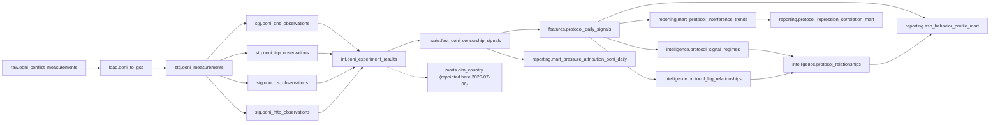
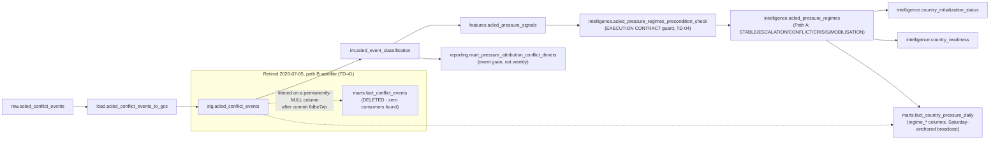
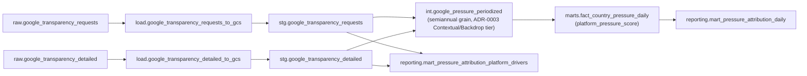
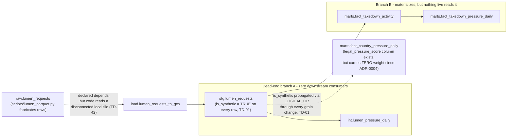
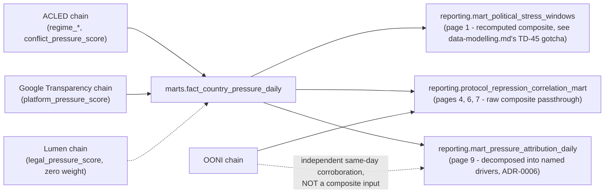

# CLIO ERD and Dataset Lineage

Status: rewritten 2026-07-12, replacing the archived pre-restructure version at `Archive/erd-lineage.md` (TD-23). This lineage diagram was generated by extracting every asset's `name:` and `depends:` fields directly from `Bruin/assets/**/*.sql` and `*.py` (54 assets, matching a clean `bruin validate` run at time of writing), not hand-drawn or recalled from a prior document. See `data-modelling.md` for the entity/schema-level view; this document is the pipeline dependency graph.

## Per-source lineage

Four sources, traced raw → load → staging → intermediate → features → intelligence → marts → reporting. Where a source's chain stops early (no features/intelligence layer), that reflects the real DAG — not an omission.

### OONI

### ACLED

### Google Transparency Report

### Lumen — synthetic, benched

## Where the sources converge

## Live guardrails this lineage depends on

Two guardrails make this DAG legible at a glance rather than silently corruptible — both are enforced in the DAG itself, not just documented:

1. **The ACLED regime engine's EXECUTION CONTRACT precondition (TD-04).** `intelligence.acled_pressure_regimes_precondition_check` sits upstream of `intelligence.acled_pressure_regimes` in the `depends:` graph (see the ACLED diagram above) and calls `ERROR()` if more than one distinct week is present for the target country/week filter. This blocks Bruin from invoking the regime asset at all on violation, rather than catching corruption after a `MERGE` already committed it — the regime engine's correctness depends on exactly-one-country-one-new-week-per-execution, and this is what actually enforces that, not just a comment.
2. **The materialization-staleness guardrail (ADR-0005).** A daily CI check (`.github/workflows/staleness-check.yml`, script at `Bruin/scripts/staleness_check/`) compares every asset's materialization timestamp against its upstream dependencies' timestamps and fails on any *new, undocumented* case where a downstream table is older than what feeds it — the general failure category behind TD-38, TD-40, and TD-54, mechanized rather than caught by hand each time. A TD-referenced allowlist (`staleness_allowlist.json`) exists for deliberate, temporary holds; resolving a TD referenced there must prune its allowlist entry in the same commit.

## Retired branches, kept visible rather than silently omitted

- **`marts.fact_conflict_events`** (ACLED path B satellite) — asset file deleted 2026-07-05, orphaned table dropped 2026-07-06 (TD-41). Had been silently producing zero rows for about a month after a commit broke its filter column; decided not worth fixing since it predates the point where ACLED's pipeline (Path A) was brought up to the same rigor already applied to OONI.
- **`marts.dim_platforms`, `dim_reasons`, `dim_regions`, `dim_requestors`** — deleted 2026-07-06 (TD-56), zero external consumers found via direct grep across `Bruin/` and `streamlit/`.
- **`marts.fact_asn_repression_index`, `fact_network_blocking_daily`** — deleted 2026-07-06 (TD-56), a dead two-asset chain with zero consumers (a prior record incorrectly believed `fact_asn_repression_index` fed dashboard pages 5/7; direct reading of `asn_behavior_profile_mart.sql`'s actual `FROM`/`depends:` disproved this before the deletion).
- **`int.ooni_signals`** — deleted 2026-07-06 (TD-56); its one consumer, `dim_country`, was repointed to `int.ooni_experiment_results` instead (same diagram above).

Verify this document against a live `bruin validate` / re-extraction of `depends:` fields before relying on it for a pipeline change — the DAG has changed materially several times in this project's history (most recently the 2026-07-06 cost-audit cleanup), and this file is a snapshot, not a live query.
